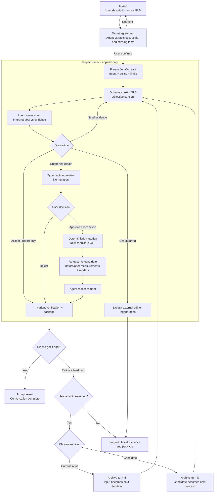

# Asset Shepherd Agent Loop

**Status:** Implemented local reference flow; Bedrock deployment remains pending
**Authority:** `PROJECT_CONTRACT.md`, D036, and `AGENT_ORCHESTRATED_WORKFLOW.md` remain controlling

## User and agent flow

There is no special “second repair.” The loop can repeat until the user accepts, the agent reaches
an unsupported disposition, or the configured limit is exhausted. The local limit is frozen per
job from `ASSET_SHEPHERD_MAX_TURNS` (default `5`, allowed `1..50`).

## Resources, tools, and mutation boundary

| Step | Required resources | Agent-visible tools | Model mutation permitted? | Durable output |
|---|---|---|---|---|
| Intake | User description; uploaded GLB stays outside the text-model call | Structured target-intake model | No | `target_intake.json`, confirmed intent |
| Objective observation | Current-turn GLB; Python GLB parser; NumPy/accessor analysis; Khronos validator when configured | `inspect_asset_for_job` | No | `inspection.json` |
| Visual sensing | Current-turn GLB; four standardized isolated views; local Blender acceptance harness pending a lightweight hosted replacement | `render_source_views_for_job` | No | Private turn-scoped source renders |
| Assessment and preview | Frozen target and policy; inspection and cited renders | `propose_agent_repair_plan` | No; tool computes and hashes consequences | Agent assessment and `repair_plan.json` |
| Approval | Exact preview, action ID/hash, Strands interrupt | `execute_selected_repairs` pauses for structured Approve/Reject | Only after exact approval | `decisions.json` |
| Execution | Current-turn GLB; deterministic GLB writer | Resumed `execute_selected_repairs` | Yes, within the approved footprint only | Candidate GLB and action provenance |
| Candidate sensing | Candidate GLB; isolated source/candidate views; shared-scale comparison; local Blender acceptance harness pending a lightweight hosted replacement | `render_candidate_views_for_job` | No | Private turn-scoped candidate and comparison renders |
| Reassessment | Source and candidate renders plus declared postconditions | `record_candidate_reassessment` | No | Typed candidate reassessment |
| Verification/package | Independent reload, bounds, source-preservation and declared-action checks | `verify_and_package` | No | Seven-file result ZIP; a rejected candidate remains a separate labeled download |
| Iteration selection and feedback | Current input or candidate plus up to 1,000 characters | New agent invocation over the same workspace-scoped Strands conversation | No | Selected source hash, append-only turn record, and feedback hash/event |

## Supported mutation tools

The agent may request only these bounded operations:

1. Uniform root scale to a confirmed semantic target dimension.
2. A bounded root quarter-turn when cited visual evidence justifies it.
3. Root translation that grounds the post-transform minimum Y at zero.
4. Index-preserving node display-name replacement.
5. Index-preserving mesh display-name replacement.
6. Approved root pivot placement at preserved origin, bounds center, or footprint center-bottom.
7. Lossless compaction of byte-identical complete vertex tuples.
8. Proven zero-area triangle and newly unreferenced tuple cleanup.
9. Exact user-reviewed disconnected-component removal for supported indexed static primitives.

The deterministic layer validates inputs, calculates the exact matrix and expected bounds, rejects
no-ops and unsupported calls, binds approval, writes the candidate, and verifies the declared
postconditions. It cannot add a transform or rename the agent did not request. Geometry, topology,
UVs, materials, textures, rigs, animation, and artistic appearance remain non-mutable.

## Turn state and provenance

Each completed turn is moved to `turns/turn-NNN/` with its output, assessments, and rendered sensor
evidence. `conversation.json` records the configured limit, current turn, acceptance state, selected
continuation source, and ordered turn links. The next turn inspects the user-selected input or
candidate as a new immutable iteration. Current `provenance.json` embeds all prior turn links,
including source/output/selected-next hashes, plan and assessment IDs, verification state,
result-ZIP hash, and the user feedback that requested continuation.

Every consequential turn therefore has a new source hash, assessment ID, Strands tool-call ID,
plan/action hash, interrupt ID, user decision, candidate hash, reassessment ID, verification, and
package. Nothing from a previous turn authorizes a later mutation.

## Stop conditions

The loop stops when any of these becomes true:

- the user accepts the current result;
- no supported change is needed;
- the asset needs an unsupported artistic, topology, material, texture, rig, or animation edit;
- a universal invariant or corruption check blocks safe continuation;
- the configured per-job turn limit is reached; or
- a provider time, token, or cost guard stops the invocation.

Turn count is implemented now. Provider-specific token and cost ceilings remain deployment
configuration work and must fail closed rather than silently starting another turn.
