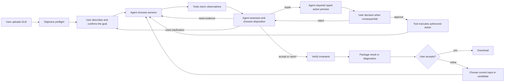

# Asset Shepherd Agent-Orchestrated Workflow

**Status:** Controlling architecture amendment

**Approved:** 2026-08-23

**Decision:** D036

Asset Shepherd is an agent that works on a 3D asset with the user. It is not a deterministic repair
pipeline with an LLM attached to the front. Deterministic code supplies trustworthy senses, bounded
actions, enforcement, and proof. The agent decides what the evidence means, whether anything should
change, which supported tool to use, and what to do next.

This document controls the product path wherever older documents describe deterministic code as
creating semantic findings, choosing repairs, or manufacturing a variable normalization plan.

## 1. The governing principle

The agent owns the work. Tools make that work safe and inspectable.

- Sensors report observations. They do not turn shape heuristics into semantic conclusions.
- The agent compares observations with the user's confirmed goal.
- The agent chooses whether to accept, investigate, repair, report, ask, or stop.
- The agent initiates every mutation through a typed, bounded tool.
- The user explicitly approves consequential changes.
- Deterministic enforcement rejects invalid, unsupported, unapproved, or corrupting actions.
- Independent sensing and verification test the result; they do not merely confirm that the requested
  command ran.

There must be no hidden rule such as "the longest axis is not Y, therefore rotate the asset." The
longest axis is an observation. For a humanoid it may be height; for a quadruped it may be body
length; for a glider it may be wingspan. Only the agent may interpret it, using the full target,
other measurements, rendered evidence, and clarification when needed.

## 2. Authority boundary

### The user owns

- Confirmation of what the asset is meant to be and how it will be used.
- Corrections when the agent misunderstood the goal.
- Approval or rejection of consequential physical or artistic changes.
- Final visual adjudication when evidence remains ambiguous.

### The agent owns

- Extracting a provisional target from ordinary language and asking only for missing material facts.
- Choosing which sensing tools to call and in what order.
- Forming, revising, and discarding hypotheses about defects.
- Distinguishing universal failures from target-dependent concerns.
- Deciding whether the asset is already acceptable, repairable with current tools, worth another
  inspection, or better returned to the creation tool.
- Choosing supported repair tools and their typed parameters.
- Explaining its evidence, uncertainty, proposed consequence, and next action.
- Reassessing the candidate after every change and iterating when useful.
- Calling verification and packaging only when it believes the candidate is ready for those stages.

Readiness may also be expressed by completing the authorized action and recording every required
candidate reassessment. If a model provider ends its response at that exact final boundary, the
deterministic layer may fulfill the mandatory verification-and-package obligation without asking the
model for another turn. It may not use that recovery to choose, authorize, execute, revise, or
visually approve any action.

The agent does not authorize its own consequential action and cannot override a failed invariant.

### Deterministic tools own

- Safe parsing of untrusted GLB data.
- Exact measurements, hashes, counts, transforms, and resource inventories.
- Standardized renders and machine comparison metrics.
- Typed parameter validation and capability limits.
- Exact transform mathematics and dry-run consequence calculation for an agent-requested action.
- Enforcement of workspace isolation, approval binding, idempotency, and mutation scope.
- Binary mutation after a valid agent call and any required user approval.
- Independent reload, invariant verification, artifact validation, and packaging.

Tools do not infer intended pose, choose a target dimension, decide that a budget is appropriate,
generate a contextual repair plan, or declare that a pictured object looks correct.

## 3. Three kinds of truth

Every statement in the job belongs to one of three classes.

1. **Universal invariants** apply to every supported GLB: parseability, valid references, finite and
   in-range data, action authorization, workspace isolation, declared mutation scope, preservation of
   untouched content, independent reload, and honest artifact/readiness state. Deterministic code may
   always enforce these. An invariant check may block a tool call without asking the agent.
2. **Observed evidence** is what a sensor measured or rendered: bounds, transforms, hierarchy,
   topology, resources, ground-plane relationship, the asset origin relative to the bounds center
   and footprint center-bottom, validator output, and standardized images. It has no semantic
   conclusion hidden inside it.
3. **Target-dependent conclusions** include intended size, which dimension represents height,
   uprightness, forward direction, grounding intent, pivot intent, piece-count intent, naming
   expectations, budgets, and whether a visible result matches the requested object. The agent owns
   these conclusions and must cite the target plus observed evidence.

A project policy may supply constraints or preferences, but it does not convert a heuristic into a
fact. For example, "the project uses Y-up coordinates" does not prove that a quadruped's longest
dimension should lie on Y.

## 4. Start-to-finish product path

The loop returns to sensing after every mutation. Verification is a gate near the end of a candidate
turn, not a substitute for agent reassessment.

If the provider ends after the final required reassessment but before its explicit package call, the
turn may cross only the invariant verification/package gate automatically. Missing decisions,
provenance, outcome, required visual reassessment, or a pending interrupt keep the turn stopped.

The product navigation has two levels. **Gallery** selects a saved workspace or starts a new one;
it is not a numbered workflow step. A selected workspace exposes **1 Upload, 2 Describe, 3
Shepherd, 4 Refine**. Shepherd creates the first candidate. Before entering Refine, the user chooses
whether the current input or candidate survives as Iteration 1. Refine is a visible loop whose
sub-items are numbered 4.1, 4.2, and so on; each pass may again promote either side. From Describe
onward, the selected immutable iteration remains visible with its measured wireframe world bounds
and optional metric axes or banana reference. During tool work, that context remains visible and
orbits slowly unless reduced motion is requested. Download remains an outcome rather than a fifth
step.

The workspace itself is an editable, append-only conversation notebook spanning the entire asset
lifecycle. It retains the Upload cell and its objective parse result; the user's Describe cell,
agent-authored target, and confirmation; and, for every Shepherd or Refine pass, the proposal, the
user's structured/freeform decision, the agent outcome, the resulting model state, and any
continuation request. Acceptance appends a Download outcome cell. New information is appended below
prior information; completing a phase never replaces its input or proposal. Editing Upload or
Describe stages a replacement and restarts dependent work from that boundary only after the edited
input validates. The workflow rail scrolls to notebook entries. User messages align right and Asset
Shepherd messages align left. The one live 3D viewer remains in a sticky evidence column; the
notebook entry nearest the viewport center selects which immutable iteration it displays. This keeps
history and the relevant model visible together without running or moving several renderers.

The interface exposes typed next actions rather than a universal composer. Immediate transitions do
not create an invented freeform feedback turn: target confirmation starts the initial workflow from
the confirmed contract, while accepting the current version invokes no model. A target correction
reveals its description field; a plan may be applied unchanged, altered through
structured choices, or supplemented by one revealed comment; and Refine reveals one outcome comment
plus the immutable input/candidate choice. The server serializes those responses as typed turn
envelopes. `PLAN_REVISION` is a non-mutating request for a fresh supported proposal.
`RESULT_REFINEMENT` makes the selected iteration the sole new input, requires fresh sensing, and
requires fresh approval for every consequential action. The agent must not infer an absent comment,
repeat an already completed repair, or call tools for interface-only transitions.

World bounds are calculated from positions actually referenced by surviving primitive indices, not
from every tuple stored in a POSITION accessor. Therefore exact component deletion immediately
changes the candidate bounds and viewer framing even when the approved index-only edit deliberately
leaves unreferenced tuples for a separate cleanup decision. The file origin is shown independently.
Removing components never silently recenters it; the agent may propose a later pivot change only
after fresh sensing in Refine and that proposal requires its own approval.

### 1. Register the source

The user uploads the GLB first. Container validation, hashing, structural eligibility, and objective
preflight may run immediately. These tools create no target-dependent finding, repair proposal,
approval, mutation, or readiness claim.

Objective preflight requires three positive finite world-space extents and rejects an asset whose
largest extent is more than 10,000 times its smallest. This is a framing and numerical-workability
invariant, not an agent inference about what shape the object ought to have. Malformed containers,
damaged GLBs, pathological bounds, and unsupported file formats stop before target intake.

### 2. Understand the goal

After upload, the user describes the model they already made. The agent extracts a provisional
target including the object, intended use, relevant scale semantics, pose, support or placement
expectations, and any important appearance or assembly requirements. It asks one concise follow-up
only when a materially different interpretation would change inspection or repair.

The user confirms the target. Confirmation freezes a versioned target record; it does not choose a
repair preset.

### 3. Choose how to inspect

Using the confirmed goal and preflight evidence, the agent chooses the next sensors. Available
sensing capabilities should include:

- structural and official glTF validation;
- world bounds, transforms, hierarchy, ground-plane measurements, and the asset origin relative to
  the world-bounds center and footprint center-bottom;
- geometry, normals, UV availability, and deterministic mesh diagnostics: boundary, non-manifold,
  and inconsistently wound edges; index-topology components; unused/coincident positions; a
  position-only virtual-weld projection; exact position-projected body inventory; bounded
  near-contact grouping hints; attribute-safe complete-tuple mergeability; vertex reuse; and
  estimated FIFO-16 cache locality;
- material, texture, alpha, and emissive metadata;
- standardized coordinate-labeled front, right, back, and left renders plus other requested views;
- before/after render and metric comparison; and
- independent Blender or Unreal evidence when the configured environment provides it.

The agent may call additional sensors, ask the user a focused question, or stop when the evidence is
already sufficient. A fixed seven-stage script must not decide this sequence for it.

Disconnected components are not semantic pieces, and coincident seam vertices can separate
otherwise adjacent faces. The component inventory projects exact positions and treats faces sharing
any projected vertex as one body. Multi-threshold near-contact AABB groups help identify tiny export
gaps but never alter exact component identity or authorize a mutation. A separate exact-tuple count proves which
vertices can be compacted without crossing any protected attribute. The agent may request that
lossless compaction; hole closing, remeshing, normal recalculation, and position-only welding remain
unavailable. Non-manifold or inconsistently wound shared edges remain report-only. Performance
estimates identify likely risk; target-engine/GPU profiling is decisive.

Duplicate positions separated by UVs, normals, tangents, colors, joints, or weights are expected
glTF representation and are not presented to the user as defects or as a safe/unsafe choice. The
agent focuses its topology explanation on the residual boundary, non-manifold, and winding evidence
from the read-only position projection. A human may decline a proposed supported repair, but cannot
reclassify an attribute-damaging position weld as safe because that operation is not registered.

Approximate target X/Y/Z lengths describe one box in the intended pose, not three independent scale
commands. After any agent-requested rotation, the preview computes one log-space best uniform scale
across the whole box and exposes the three residuals. The reassessing agent checks execution,
appearance, pose, and whether a new defect appeared. It does not turn an expected residual into a
failure merely because one fitted dimension is not numerically equal to the target.

Grounding and pivot placement are measured and reasoned about separately. A model may touch the
ground plane while its asset origin remains on a rear edge. For a plainly grounded static prop, the
agent may request the footprint center-bottom as the placement anchor; a freely rotating pickup may
use the bounds center. When the user requests a semantic feature such as a handle center, the agent
first calls the pivot sensor. That tool returns source-hash-bound IDs for exact bounds centers and
corners, the surface-area centroid, long-axis end-region centers, and a uniform-volume centroid only
for proven closed consistently wound topology. After reviewing all four coordinate-labeled views,
the agent may select one returned ID whose region clearly matches the requested feature. If none
does, it preserves the authored origin or asks. The model never supplies arbitrary translation XYZ.

### 4. Form an assessment

The agent produces a compact assessment with:

- what it believes should be true and why;
- what the tools actually observed; and
- what, if anything, deserves attention.

Normal facts are summarized. Important contradictions, uncertainty, and unsupported areas are
explicit. If the asset is unusable or a required repair is outside the current tool set, the agent
recommends returning to the creation/export tool instead of inventing a repair.

### 5. Choose a disposition

For each material concern, the agent chooses one disposition:

- accept as-is;
- gather more evidence;
- ask the user for clarification;
- report without changing the file;
- repair with a supported tool; or
- stop and recommend regeneration or external editing.

No deterministic planner chooses this disposition. No repair is included merely because a profile
comparison emitted a code.

### 6. Design and preview a supported repair

The current mutation scope remains narrow, but its use is agent-directed. The agent may call typed
preview tools for supported primitives such as:

- uniform root scale;
- root rotation;
- root translation for grounding or a bounded preset/registered measured pivot target;
- node display-name change; and
- mesh display-name change; and
- exact zero-area triangle removal with complete unused-vertex-tuple compaction; and
- exact approved disconnected-component filtering for a proven-safe primitive.

The agent chooses which primitives are needed and supplies their typed intent and parameters. The
tool computes the exact matrix or edit, expected bounds, affected records, reversibility, and
preservation obligations. It returns a hashed proposed action without mutating the file.

The UI never exposes raw transform controls to the user. The deterministic layer may reject unsafe,
unsupported, malformed, or out-of-scope parameters, but it does not add a scale, rotation,
translation, pivot placement, or rename that the agent did not request.

The geometry cleanup is a separate consequential lane. The agent may request it only when the
sensor marks the primitive `degenerate_cleanup_safe`; the user may accept, reject, or comment, and
the exact action still requires the overall approval. The deterministic tool removes only proven
zero-area triangle index triples and complete vertex tuples no surviving triangle references. It
does not weld seams, close holes, recalculate normals, remesh, or remove semantic components. A
physical normalization, lossless duplicate-tuple weld, or broader geometry concern requires a
separate turn.

Disconnected-component filtering is also a separate consequential lane. It is available only when
the sensor marks the primitive `component_removal_safe`. The agent must cite all four labeled source
views, pass exact inventory IDs, and retain at least one body. Near-contact groups are interpretation
hints only. The user may keep, remove, or comment on each body; a changed selection reopens planning
without mutation. Execution filters only the approved index triples and does not compact vertices,
weld gaps, merge shells, infer semantics, or apply keep-largest/remove-small heuristics.

### 7. Obtain the required decision

The agent explains the proposed result in one compact message. The exact typed proposal is shown
through the structured decision control.

Each proposed repair lane offers `Accept` or `Reject`, and each safely selectable disconnected body
offers `Keep` or `Remove`. These are plan responses, not independent mutation buttons. Exact safe
components stay selectable even when the agent recommends keeping all of them; the selected
defaults communicate the recommendation without taking authority away from the human. One optional
wide comment applies to the whole turn instead of creating competing per-row conversations.

All structured choices and the optional comment are returned through the native interrupt as one
atomic typed user turn. If every active default remains selected and the comment is empty, **Apply
recommendations** binds consequential authorization to the exact proposed action hash. Any changed
choice or non-empty comment changes that action to **Send revision**: the proposal and complete
feedback set are archived durably, no GLB mutation occurs, and the same workspace-scoped agent
resumes to gather evidence and form a fresh proposal. It may not silently restore a rejected action,
drop one part of the atomic response, or argue past the user's response. **Download this version**
exposes the current iteration without approving the pending proposal.

Non-consequential actions may use an explicitly preauthorized project rule, but the agent must still
initiate the action tool call; there is no background mutation pass. While an agent request is in
flight, the UI hides stale questions, decisions, and feedback controls and shows only the observable
tool-activity list. A cancel control must not be shown until the runtime supports real cooperative
cancellation.

### 8. Execute the approved action

The agent calls the execution tool. The deterministic layer checks the action hash, authorization,
workspace, source identity, idempotency key, and allowed mutation footprint before writing a
candidate. It records exactly what changed.

On a later repair turn, a new normalization delta is composed into the existing root only when the
immediately preceding output hash, archived plan and provenance, active-root structure, root
identity, and exact before matrix prove Asset Shepherd authored it. The action records `delta`,
`before`, and `after = delta @ before`; verification permits that exact matrix change and no new
wrapper node. A familiar root name without proven lineage grants no mutation authority.

### 9. Re-observe and reassess

The candidate is a new state of the same asset conversation. After a physical or topology mutation,
the agent calls fresh measurements and standardized renders, compares them with both the source and
confirmed goal, and decides whether the change worked. Isolated source and candidate views
establish presence and appearance; a separate shared-scale render establishes relative size. A
candidate that is tiny in the shared view is not therefore absent. An index-preserving
display-name-only candidate skips this visual gate because exact independent inventory and payload
verification proves that those JSON edits cannot change rendered appearance.

The before/after viewer is therefore more than decorative UI: its standardized render artifacts are
available to a vision-capable workflow model as sensing evidence. Pixel metrics may detect change,
but semantic correctness remains an agent judgment with stated confidence. When vision is not
available, the agent must mark visual claims as unevaluated or ask for human confirmation.

File existence is not render evidence. Each standardized image must decode and its deterministic
object mask must prove useful foreground occupancy, projected span, and frame margin before the
image reaches the model. Evidence records the image and mask hashes plus these quality metrics.

If a repair introduces or reveals another problem, the agent returns to inspection and may design a
new action. Every new consequential action receives a fresh proposal and approval. Iteration is
bounded by configured time, cost, and repeated-failure limits, not by a hard-coded one-retry repair
script.

The target interaction surface presents those iterations as a chronological notebook: agent report,
model state, then the atomic human response. Completed turns remain readable in order. The workflow
rail navigates turn anchors instead of duplicating controls. Only one 3D scene is live: the turn
nearest the viewport center receives the shared scene host, while historical markup loads lazily
from an output-hash-bound route. Moving to another turn replaces that markup instead of leaving
another WebGL renderer alive.

### 10. Verify invariants

When the agent believes the candidate satisfies the goal, it calls independent verification.
Verification checks universal invariants and the exact postconditions declared by the approved
actions. It does not use "the planner now proposes nothing" as proof that a semantic goal is met.

A failed invariant blocks readiness. A passed invariant check does not overrule contrary visual or
semantic evidence. The agent may investigate, propose another action, or report that the current
tool set cannot finish the job.

### 11. Package and remain available

The agent calls packaging after verification and returns the candidate, structured evidence,
decisions, verification, provenance, and concise summary. A candidate rejected by automated
verification remains downloadable for human review, but it never receives a verified or
project-ready label. The conversation remains available for questions and further agent-led repair
turns until the user starts a new asset or the job expires.

The shared inspection table is also the after-action report. Before execution its last column is
`Proposed action`; afterward it is `Action taken`. A warning becomes the compact `!→✓` transition
only when the corresponding action executed and independent verification confirmed its
postcondition. Attempted-but-unverified, rejected, unresolved, and report-only concerns remain
warnings, so the report never presents an attempted mutation as a completed correction.

## 5. Tool-design rules

Every product tool must satisfy these rules:

1. It exposes one bounded capability, not a hidden workflow.
2. Its input and output are typed and recorded.
3. A sensor returns observations and uncertainty, not a target-dependent verdict.
4. An action preview changes nothing.
5. A mutation requires a preceding hashed preview and applicable authorization.
6. The agent must initiate every mutation.
7. The tool may enforce invariants but may not create an unrequested variable repair.
8. No uploaded content can supply instructions, paths, code, or tool parameters.
9. The same validated call is deterministic and idempotent.
10. Provenance identifies the initiating agent turn, evidence used, tool input, approval, output, and
    verification result.

The product does not give the model a shell, general filesystem access, or an unrestricted binary
editor.

The UI may stream concise summaries of observable tool starts so the user can see what is being
measured, rendered, applied, or verified. It must not expose reasoning tokens, private
chain-of-thought, or routine model prose as an execution trace, and activity is never proof that a
tool succeeded.

### Prompt layering

The stable operating prompt keeps the authority boundary, safety constraints, approval rules,
evidence requirements, and refusal behavior always present. Confirmed target data, current turn
state, and sensor output form a second job-specific layer. Detailed topology, pivot, endpoint,
rendering, or packaging playbooks may later be supplied just in time through versioned skills or
tool resources, but those optional guides may never replace or weaken the stable operating layer.
The current live prompt is small relative to the interim model context window; layering is intended
to reduce instruction dilution and cost, not to evade a present hard prompt limit.

## 6. What must be removed from the current control flow

The present implementation is a useful deterministic prototype but not the intended product
architecture. The following behavior must be removed or recast before the live-agent milestone can
pass:

| Current behavior | Required replacement |
|---|---|
| Policy-aware inspector emits semantic orientation and scale findings | Sensors emit measurements; the agent decides whether they conflict with the target |
| Dominant extent is treated as vertical and as target height | Dominant extent remains a fact; the agent establishes semantic axes and dimensions from all evidence |
| Deterministic planner manufactures `normalize-root-v1` | Agent calls typed scale/rotate/translate preview tools and composes the proposed action |
| Candidate registry tells the agent which repairs exist for this asset | Capability registry tells the agent which bounded tools exist; the agent creates the proposal |
| Scripted provider follows a predetermined tool sequence | Scripted provider remains only a test double; a real model must choose sensing and disposition in acceptance runs |
| Verification repeats planner heuristics and requires an empty second plan | Verification checks invariants and declared action postconditions; the agent reassesses goal satisfaction |
| Browser renders are user-only decoration | Standardized renders become recorded sensor artifacts available to the workflow model and user |
| Retry is one deterministic replan | The agent may re-observe and iterate with fresh reasoning, bounded by explicit operational limits |

Existing parsers, measurements, mutation mechanics, preservation checks, approval binding, durable
state, artifact schemas, and comparison UI are reusable. Their authority changes; they do not need to
be discarded.

## 7. Acceptance gate for the corrected architecture

The agent-orchestrated milestone is not complete until all of these pass:

1. A real workflow model, not the scripted test double, chooses its sensor sequence on representative
   assets.
2. Every mutation in provenance traces to an explicit agent tool call and applicable approval.
3. No deterministic component creates a target-dependent finding or repair without an agent request.
4. A grounded Y-up quadruped whose longest axis is body length is not rotated merely because that
   axis is Z.
5. The same GLB under materially different confirmed goals can produce different agent assessments
   without changing universal invariant results.
6. An ambiguous orientation causes more sensing or a user question, not a confident scripted repair.
7. A yaw decision compares semantic front cues across all four labeled source views against glTF
   +Z forward; it never derives front from the longest extent, and ambiguity produces no rotation.
8. Before/after standardized renders are available to the workflow model, and visual claims identify
   their evidence and confidence.
9. A consequential second repair requires a fresh approval and can complete within the same durable
   conversation.
10. Invalid, unauthorized, out-of-scope, or corrupting action calls fail closed.
11. The final package distinguishes measured facts, agent conclusions, user decisions, and invariant
    verification.
12. Consequential later turns preserve one proven normalization root, and every model-visible
    render passes deterministic decodability, occupancy, and framing checks.

Until this gate passes, the existing deterministic run is a repair-engine test harness, not evidence
that the Asset Shepherd product is agent orchestrated.
