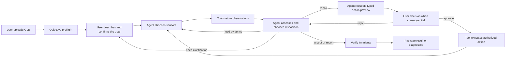

# Asset Shepherd Agent-Orchestrated Workflow

**Status:** Controlling architecture amendment

**Approved:** 2026-08-23

**Decision:** D036

Asset Shepherd is an agent that works on a 3D asset with the user. It is not a deterministic repair
pipeline with an LLM attached to the front. Deterministic code supplies trustworthy senses, bounded
actions, enforcement, and proof. The agent decides what the evidence means, whether anything should
change, which supported tool to use, and what to do next.

This document controls the product path wherever older documents describe deterministic code as
creating semantic findings, choosing repairs, or manufacturing a variable normalization plan.

## 1. The governing principle

The agent owns the work. Tools make that work safe and inspectable.

- Sensors report observations. They do not turn shape heuristics into semantic conclusions.
- The agent compares observations with the user's confirmed goal.
- The agent chooses whether to accept, investigate, repair, report, ask, or stop.
- The agent initiates every mutation through a typed, bounded tool.
- The user explicitly approves consequential changes.
- Deterministic enforcement rejects invalid, unsupported, unapproved, or corrupting actions.
- Independent sensing and verification test the result; they do not merely confirm that the requested
  command ran.

There must be no hidden rule such as "the longest axis is not Y, therefore rotate the asset." The
longest axis is an observation. For a humanoid it may be height; for a quadruped it may be body
length; for a glider it may be wingspan. Only the agent may interpret it, using the full target,
other measurements, rendered evidence, and clarification when needed.

## 2. Authority boundary

### The user owns

- Confirmation of what the asset is meant to be and how it will be used.
- Corrections when the agent misunderstood the goal.
- Approval or rejection of consequential physical or artistic changes.
- Final visual adjudication when evidence remains ambiguous.

### The agent owns

- Extracting a provisional target from ordinary language and asking only for missing material facts.
- Choosing which sensing tools to call and in what order.
- Forming, revising, and discarding hypotheses about defects.
- Distinguishing universal failures from target-dependent concerns.
- Deciding whether the asset is already acceptable, repairable with current tools, worth another
  inspection, or better returned to the creation tool.
- Choosing supported repair tools and their typed parameters.
- Explaining its evidence, uncertainty, proposed consequence, and next action.
- Reassessing the candidate after every change and iterating when useful.
- Calling verification and packaging only when it believes the candidate is ready for those stages.

The agent does not authorize its own consequential action and cannot override a failed invariant.

### Deterministic tools own

- Safe parsing of untrusted GLB data.
- Exact measurements, hashes, counts, transforms, and resource inventories.
- Standardized renders and machine comparison metrics.
- Typed parameter validation and capability limits.
- Exact transform mathematics and dry-run consequence calculation for an agent-requested action.
- Enforcement of workspace isolation, approval binding, idempotency, and mutation scope.
- Binary mutation after a valid agent call and any required user approval.
- Independent reload, invariant verification, artifact validation, and packaging.

Tools do not infer intended pose, choose a target dimension, decide that a budget is appropriate,
generate a contextual repair plan, or declare that a pictured object looks correct.

## 3. Three kinds of truth

Every statement in the job belongs to one of three classes.

1. **Universal invariants** apply to every supported GLB: parseability, valid references, finite and
   in-range data, action authorization, workspace isolation, declared mutation scope, preservation of
   untouched content, independent reload, and honest artifact/readiness state. Deterministic code may
   always enforce these. An invariant check may block a tool call without asking the agent.
2. **Observed evidence** is what a sensor measured or rendered: bounds, transforms, hierarchy,
   topology, resources, ground-plane relationship, validator output, and standardized images. It has
   no semantic conclusion hidden inside it.
3. **Target-dependent conclusions** include intended size, which dimension represents height,
   uprightness, forward direction, grounding intent, piece-count intent, naming expectations,
   budgets, and whether a visible result matches the requested object. The agent owns these
   conclusions and must cite the target plus observed evidence.

A project policy may supply constraints or preferences, but it does not convert a heuristic into a
fact. For example, "the project uses Y-up coordinates" does not prove that a quadruped's longest
dimension should lie on Y.

## 4. Start-to-finish product path

The loop returns to sensing after every mutation. Verification is a gate near the end of a candidate
turn, not a substitute for agent reassessment.

### 1. Register the source

The user uploads the GLB first. Container validation, hashing, structural eligibility, and objective
preflight may run immediately. These tools create no target-dependent finding, repair proposal,
approval, mutation, or readiness claim.

### 2. Understand the goal

After upload, the user describes the model they already made. The agent extracts a provisional target including
the object, intended use, relevant scale semantics, pose or support expectations, and any important
appearance or assembly requirements. It asks one concise follow-up only when a materially different
interpretation would change inspection or repair.

The user confirms the target. Confirmation freezes a versioned target record; it does not choose a
repair preset.

### 3. Choose how to inspect

Using the confirmed goal and preflight evidence, the agent chooses the next sensors. Available
sensing capabilities should include:

- structural and official glTF validation;
- world bounds, transforms, hierarchy, and ground-plane measurements;
- geometry, normals, UV availability, and deterministic mesh diagnostics: boundary, non-manifold,
  and inconsistently wound edges; index-topology components; unused/coincident positions; vertex
  reuse; and estimated FIFO-16 cache locality;
- material, texture, alpha, and emissive metadata;
- standardized coordinate-labeled front, right, back, and left renders plus other requested views;
- before/after render and metric comparison; and
- independent Blender or Unreal evidence when the configured environment provides it.

The agent may call additional sensors, ask the user a focused question, or stop when the evidence is
already sufficient. A fixed seven-stage script must not decide this sequence for it.

Edge-connected components are not semantic pieces, and coincident seam vertices can separate
otherwise adjacent faces. Open boundaries, component count, coincident positions, and cache
estimates therefore require target-aware agent interpretation. Non-manifold or inconsistently wound
shared edges are objective defects, but remain report-only because no topology rewrite tool is
authorized. Performance estimates identify likely risk; target-engine/GPU profiling is decisive.

### 4. Form an assessment

The agent produces a compact assessment with:

- what it believes should be true and why;
- what the tools actually observed; and
- what, if anything, deserves attention.

Normal facts are summarized. Important contradictions, uncertainty, and unsupported areas are
explicit. If the asset is unusable or a required repair is outside the current tool set, the agent
recommends returning to the creation/export tool instead of inventing a repair.

### 5. Choose a disposition

For each material concern, the agent chooses one disposition:

- accept as-is;
- gather more evidence;
- ask the user for clarification;
- report without changing the file;
- repair with a supported tool; or
- stop and recommend regeneration or external editing.

No deterministic planner chooses this disposition. No repair is included merely because a profile
comparison emitted a code.

### 6. Design and preview a supported repair

The current mutation scope remains narrow, but its use is agent-directed. The agent may call typed
preview tools for supported primitives such as:

- uniform root scale;
- root rotation;
- root translation or grounding;
- node display-name change; and
- mesh display-name change.

The agent chooses which primitives are needed and supplies their typed intent and parameters. The
tool computes the exact matrix or edit, expected bounds, affected records, reversibility, and
preservation obligations. It returns a hashed proposed action without mutating the file.

The UI never exposes raw transform controls to the user. The deterministic layer may reject unsafe,
unsupported, malformed, or out-of-scope parameters, but it does not add a scale, rotation,
translation, or rename that the agent did not request.

### 7. Obtain the required decision

The agent explains the proposed result in one compact message. The exact typed proposal is shown
through the structured decision control.

Consequential changes require explicit user approval bound to the proposed action hash. Rejection is
durable. Non-consequential actions may use an explicitly preauthorized project rule, but the agent
must still initiate the action tool call; there is no background mutation pass.

### 8. Execute the approved action

The agent calls the execution tool. The deterministic layer checks the action hash, authorization,
workspace, source identity, idempotency key, and allowed mutation footprint before writing a
candidate. It records exactly what changed.

### 9. Re-observe and reassess

The candidate is a new state of the same asset conversation. The agent calls fresh measurements and
standardized renders, compares them with both the source and confirmed goal, and decides whether the
change worked.

The before/after viewer is therefore more than decorative UI: its standardized render artifacts are
available to a vision-capable workflow model as sensing evidence. Pixel metrics may detect change,
but semantic correctness remains an agent judgment with stated confidence. When vision is not
available, the agent must mark visual claims as unevaluated or ask for human confirmation.

If a repair introduces or reveals another problem, the agent returns to inspection and may design a
new action. Every new consequential action receives a fresh proposal and approval. Iteration is
bounded by configured time, cost, and repeated-failure limits, not by a hard-coded one-retry repair
script.

### 10. Verify invariants

When the agent believes the candidate satisfies the goal, it calls independent verification.
Verification checks universal invariants and the exact postconditions declared by the approved
actions. It does not use "the planner now proposes nothing" as proof that a semantic goal is met.

A failed invariant blocks readiness. A passed invariant check does not overrule contrary visual or
semantic evidence. The agent may investigate, propose another action, or report that the current
tool set cannot finish the job.

### 11. Package and remain available

The agent calls packaging after verification and returns the candidate, structured evidence,
decisions, verification, provenance, and concise summary. The conversation remains available for
questions and further agent-led repair turns until the user starts a new asset or the job expires.

## 5. Tool-design rules

Every product tool must satisfy these rules:

1. It exposes one bounded capability, not a hidden workflow.
2. Its input and output are typed and recorded.
3. A sensor returns observations and uncertainty, not a target-dependent verdict.
4. An action preview changes nothing.
5. A mutation requires a preceding hashed preview and applicable authorization.
6. The agent must initiate every mutation.
7. The tool may enforce invariants but may not create an unrequested variable repair.
8. No uploaded content can supply instructions, paths, code, or tool parameters.
9. The same validated call is deterministic and idempotent.
10. Provenance identifies the initiating agent turn, evidence used, tool input, approval, output, and
    verification result.

The product does not give the model a shell, general filesystem access, or an unrestricted binary
editor.

## 6. What must be removed from the current control flow

The present implementation is a useful deterministic prototype but not the intended product
architecture. The following behavior must be removed or recast before the live-agent milestone can
pass:

| Current behavior | Required replacement |
|---|---|
| Policy-aware inspector emits semantic orientation and scale findings | Sensors emit measurements; the agent decides whether they conflict with the target |
| Dominant extent is treated as vertical and as target height | Dominant extent remains a fact; the agent establishes semantic axes and dimensions from all evidence |
| Deterministic planner manufactures `normalize-root-v1` | Agent calls typed scale/rotate/translate preview tools and composes the proposed action |
| Candidate registry tells the agent which repairs exist for this asset | Capability registry tells the agent which bounded tools exist; the agent creates the proposal |
| Scripted provider follows a predetermined tool sequence | Scripted provider remains only a test double; a real model must choose sensing and disposition in acceptance runs |
| Verification repeats planner heuristics and requires an empty second plan | Verification checks invariants and declared action postconditions; the agent reassesses goal satisfaction |
| Browser renders are user-only decoration | Standardized renders become recorded sensor artifacts available to the workflow model and user |
| Retry is one deterministic replan | The agent may re-observe and iterate with fresh reasoning, bounded by explicit operational limits |

Existing parsers, measurements, mutation mechanics, preservation checks, approval binding, durable
state, artifact schemas, and comparison UI are reusable. Their authority changes; they do not need to
be discarded.

## 7. Acceptance gate for the corrected architecture

The agent-orchestrated milestone is not complete until all of these pass:

1. A real workflow model, not the scripted test double, chooses its sensor sequence on representative
   assets.
2. Every mutation in provenance traces to an explicit agent tool call and applicable approval.
3. No deterministic component creates a target-dependent finding or repair without an agent request.
4. A grounded Y-up quadruped whose longest axis is body length is not rotated merely because that
   axis is Z.
5. The same GLB under materially different confirmed goals can produce different agent assessments
   without changing universal invariant results.
6. An ambiguous orientation causes more sensing or a user question, not a confident scripted repair.
7. A yaw decision compares semantic front cues across all four labeled source views against glTF
   +Z forward; it never derives front from the longest extent, and ambiguity produces no rotation.
8. Before/after standardized renders are available to the workflow model, and visual claims identify
   their evidence and confidence.
9. A consequential second repair requires a fresh approval and can complete within the same durable
   conversation.
10. Invalid, unauthorized, out-of-scope, or corrupting action calls fail closed.
11. The final package distinguishes measured facts, agent conclusions, user decisions, and invariant
    verification.

Until this gate passes, the existing deterministic run is a repair-engine test harness, not evidence
that the Asset Shepherd product is agent orchestrated.
