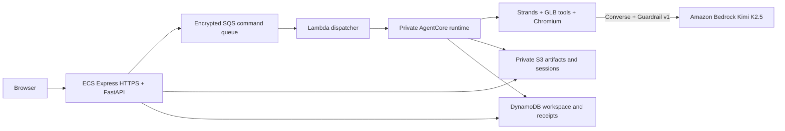
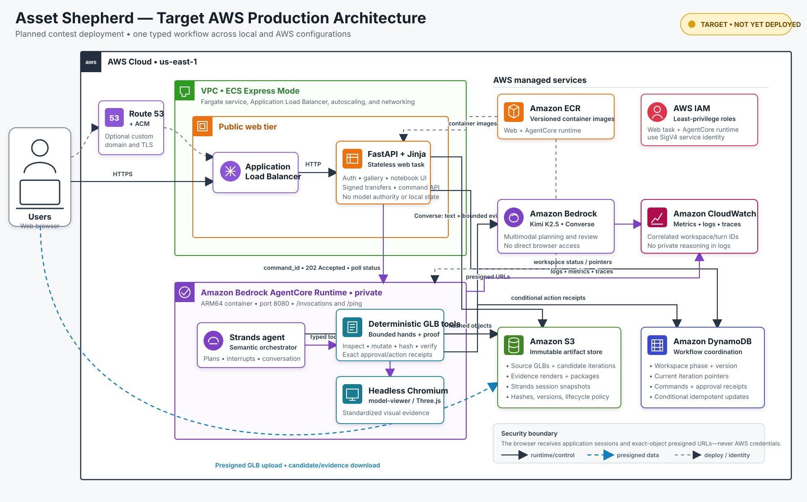
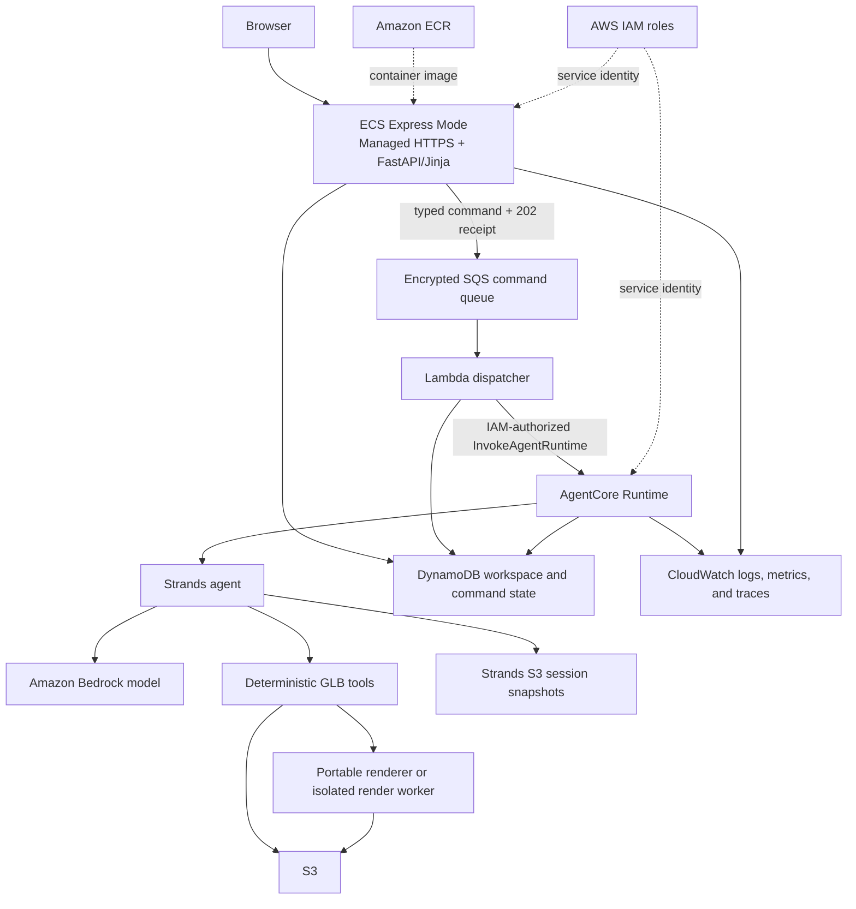

# Bedrock and Strands Deployment Runbook

**Status:** Approved procedure; Kimi passes the fixed 8/8 provider gate, private S3/DynamoDB state
and Strands sessions are live, and the public ECS/SQS/Lambda/AgentCore path has completed one clean
acceptance-through-download run plus forced web-task replacement; alarm inbox delivery is verified;
Step 7 identity isolation and the full Step 8 remote matrix remain open. D111 adds invite-only
Cognito login to the shared demo; rollout and human acceptance are tracked in
`HOSTED_LOGIN_RUNBOOK.md` and `PROJECT_STATUS.md`.

**Last verified against the live deployment:** 2026-09-05

**D116 upload addendum:** The current upload-first UI acknowledges the GLB before expensive
profile-free diagnostics. An isolated, one-at-a-time web subprocess performs the check with a
four-minute deadline; authenticated polling displays progress and explicit failure/retry. The
description step reuses the exact source-hash-bound result instead of repeating the diagnostic.
No model call, new AWS service, task-size increase, or ALB timeout increase is required. Task-local
pre-intake drafts still do not survive ECS task replacement; direct S3/durable draft work remains
open. The same source implements local and hosted behavior. Test locally, pass the common gate,
then build the immutable web image (including Linux upload smoke acceptance) and roll it out.

**D112 provider addendum:** Bedrock Luna still returns account unavailability. The hosted app now
offers explicit Luna xhigh through the OpenAI API, using a separate Secrets Manager key and exact
backend-role grants. Kimi remains the default; no silent fallback or existing-workspace migration
is enabled. `HOSTED_OPENAI_RUNBOOK.md` controls this opt-in exception to the original Bedrock-only
production migration steps below, including separate billing and measured AgentCore acceptance.

**Milestone:** M9 hosted Bedrock conversation and deployment

Asset Shepherd already uses Strands as its orchestration layer. This runbook moves the two live
model boundaries from OpenAI to Amazon Bedrock, then moves filesystem-backed application state and
the agent runtime from one Windows workstation to AWS without changing the user/agent/tool authority
contract.

The migration has three independent proof gates:

1. **Bedrock provider gate:** the unchanged local product completes representative workflows using
   Bedrock and makes no OpenAI request.
2. **Cloud-portability gate:** every required job artifact, session, approval, and render can be
   recovered without relying on process memory or a workstation path.
3. **Remote-product gate:** the browser product completes upload through download against the
   remotely hosted agent with observable, bounded, restart-safe behavior.

Do not combine these gates into one debugging exercise. Keep the current local product runnable
until the remote-product gate passes.

## Execution status

- [x] Step 1.1 workstation inspection: AWS CLI v2.36.34 is installed per-user. The Codex process
  inherited an older PATH, so the current shell cannot resolve `aws`; a new terminal should.
- [x] Step 1.2 the bootstrap administrator identity is verified through the local
  `asset-shepherd-admin` profile; the separate least-privilege `asset-shepherd` role/profile is
  created and verified without making a paid model call. Do not publish the underlying IAM user.
- [x] Step 1.3 Kimi K2.5, Claude Haiku 4.5, Mistral Large 3, Qwen3 VL 235B, and Nova 2 Lite accept
  bounded calls in `us-east-1`; Kimi is the recommended selection (D077/D078).
- [x] Step 1.4 the user confirmed an AWS Budget zero-cost alert and $100 promotional-credit
  allocation. The alert is notification rather than a hard spending cap, and credit eligibility
  remains subject to the account's credit terms. On 2026-09-02 the user reported approximately
  $130 in credits remaining and roughly $20 used; treat that as planning input, not an audited
  billing balance. After earning additional credits, the user reported $158 remaining on
  2026-09-04; this is also planning input rather than an audited balance.
- [x] Step 2.1/2.2 Bedrock intake, workflow transport, short-term-token, and launcher implementation.
- [x] D074 Nova diagnostic: least-privilege connectivity, typed intake, and one complete local
  Strands approval-through-package workflow passed through native Bedrock Converse.
- [x] D077/D078 canonical `bedrock-converse` adapter and five-model allowlist. Kimi K2.5 and Claude
  Haiku 4.5 passed typed
  intake and the complete image/tool/approval/verification/package workflow; the upload UI persists
  a fail-closed per-asset model selection with usage hints.
- [x] One representative local browser loop reached verified packaging through Nova: intake and
  sensing succeeded, the first medium-reasoning turn exhausted its 8,192-token allowance, a
  low-reasoning retry produced only naming cleanup, explicit user correction produced an
  approval-gated proportional fit, and deterministic execution independently verified the final
  `1.22376 x 0.820321 x 0.268958 m` candidate grounded at `Y=0`. This qualifies Nova as a usable
  diagnostic path, not the default parity model or a completed browser matrix.
- [x] D093 supersedes D075 and selects ECS Express Mode as the first public FastAPI host beside
  IAM-controlled AgentCore. AWS has closed App Runner to new customers.
- [x] Step 2.3 fixed Bedrock provider gate. Kimi passes 8/8 safety and 8/8 semantic/visual cases
  through the least-privilege profile. Mistral Large 3 fails two hard semantic cases and is not a
  production default. Luna's optional Bedrock evaluation remains separately blocked by its account
  agreement.
- [x] D095 opt-in external comparator. Muse Spark 1.3 passes three local representative cases
  through Meta's Model API, including opposite component-selection decisions. This does not alter
  the AWS production topology or satisfy the fixed eight-case gate.
- [x] D096 native Gemini comparator implementation. The exact Gemini 3.8 Flash model is available
  for isolated local comparison without entering the canonical AWS deployment. Native structured
  intake and one complete broken-normalization workflow pass; the full release matrix has not run.
- [ ] Step 3 cloud-portable state and artifacts. The retained `asset-shepherd-state` CloudFormation
  stack, content-addressed S3 artifact manifests, S3 Strands-session selection, owner-indexed
  DynamoDB records, conditional versions, and a live clean-process round trip pass. Full
  kill-and-resume coverage at every workflow phase remains.
- [x] Step 4 deployable visual sensing. CodeBuild produced a `linux/arm64` image, then launched that
  exact image and passed four source views, four shared-scale views, masks, and the application
  import gate through packaged Debian Chromium. The accepted compressed image is 387,633,373 bytes.
- [x] Step 5 AgentCore runtime. The private runtime, dedicated service-only role, typed status,
  planning, exact approval interrupt/resume, deterministic execution, Chromium reassessment, and
  packaging paths are live. The frozen broken-normalization case completed with a verified,
  packaged candidate; exact duplicate approval and a forced runtime replacement both rehydrated
  the same durable version without repeating the mutation.
- [x] Step 6 remote web product. The managed HTTPS endpoint completed upload, HTTP 202 dispatch,
  exact approval, deterministic repair, acceptance, download, gallery return, and forced ECS task
  replacement without losing the durable workspace.
- [ ] Step 7 operations and cleanup. The dashboard, eight project alarms, private notification
  topic, seven-day log retention,
  bounded correlation fields, exact-workspace purge, S3 lifecycle, DynamoDB TTL, observed Kimi
  subtotal, and live idle-cost floor are complete. The immutable Guardrail passes direct 8/8
  boundary and Kimi/Converse probes, and rebuilt public-application acceptance. Alarm notification
  delivery is verified through the recipient inbox. Authentication remains.
- [ ] Step 8 remote M9 acceptance.

## Controlling constraints

- Keep `workspace_id` as the per-asset conversation and session authority.
- Keep the Strands agent as the semantic orchestrator and the deterministic GLB tools as the
  measurement, bounded-mutation, authorization, and verification authority.
- Do not let chat text authorize a mutation. Consequential changes retain the exact structured
  Strands interrupt, action hash, and explicit user approval.
- Keep source files immutable. Every mutation creates a separately hashed candidate.
- Do not introduce a second conversational authority. AgentCore Memory is optional and is not part
  of the first deployment; Strands session snapshots remain authoritative.
- Do not put the interactive FastAPI/Jinja website inside the AgentCore invocation contract.
- Do not send GLB bytes through every model or AgentCore turn. Upload assets to private object
  storage and pass only a workspace-scoped reference plus its hash.
- Do not scatter a Bedrock model ID outside the reviewed capability registry or assume an old
  tutorial's region availability.
- Do not create paid resources or invoke a paid model before caller identity, region/model access,
  and a budget alert are confirmed.
- Stop for approval before architecture expected to cost more than $10 during development or more
  than $2 per idle day.
- The local Kimi provider gate is complete. Make no further paid model bakeoff calls unless a code
  regression invalidates a frozen case; reserve the next paid work for deployment proof and the
  remote acceptance replay.
- Meta Contributor mode is evaluation-only and requires the user's explicit training-data consent
  flag. Never enable it for production or for an asset outside that consented evaluation set.
- Never commit credentials, account IDs, tokens, presigned URLs, or secret-bearing command output.

## Target deployment shape

### Current live topology (what exists now)



The browser is the only local component in the public path. Managed HTTPS, the FastAPI/Jinja web
task, durable queue/dispatcher bridge, AgentCore/Strands runtime, deterministic tools, Chromium,
Kimi inference, Guardrail, S3, DynamoDB, CloudWatch, CodeBuild, and ECR are live in AWS. Local
development remains available as a separate launch mode; it is not part of this production request
path. The authenticated `asset-shepherd` AWS CLI profile remains a separate restricted local-test
identity and is never delivered to the browser.

The optional Meta/Muse and Google/Gemini comparators are separate local test configurations: local
Strands calls the selected external API over outbound HTTPS instead of Bedrock. They are
deliberately absent from the canonical AWS contest-deployment diagram. Deploying either later would
require a reviewed secret, AgentCore internet egress, privacy and retention review, and a new
architecture decision. Muse would additionally require the standard non-training checkpoint.

Current AWS evidence is visible in these places in `us-east-1`:

- **Amazon Bedrock → Model catalog:** search for Kimi K2.5 to see the active model and its in-region
  model ID. This is an on-demand model, not an Asset Shepherd service configuration.
- **CloudWatch → Metrics → All metrics → `AWS/Bedrock` → By ModelId:** view invocation count,
  latency, input/output tokens, and errors for `moonshotai.kimi-k2.5`.
- **IAM → Roles → `AssetShepherdBedrockRuntime`:** review the least-privilege runtime role. The
  friendly local profile name `asset-shepherd` exists in the workstation's AWS configuration, not
  as a console service.
- **CloudFormation → Stacks → `asset-shepherd-state`:** review the deployed retained state stack.
- **CloudFormation → Stacks → `asset-shepherd-container-build`:** review the ECR/CodeBuild
  foundation and short-retention source bucket.
- **CodeBuild → Build projects → `asset-shepherd-contest-runtime`:** review the ARM64 image gate and
  its Chromium/source/shared-scale acceptance logs.
- **ECR → Private registry → Repositories → `asset-shepherd-contest`:** review accepted immutable
  deployment image tags and scan results.
- **Amazon Bedrock → AgentCore → Runtime:** review `AssetShepherdRuntime`, its deployed ARM64
  container version, invocation state, and service-only execution role.
- **CloudFormation → Stacks → `asset-shepherd-agentcore`:** review the private runtime and its
  dedicated least-privilege role as one versioned deployment.
- **S3:** the generated private workspace bucket contains content-addressed workspace objects,
  immutable manifests, and Strands session snapshots. Public access is blocked.
- **DynamoDB:** the generated workspace table contains the owner-scoped active record and its
  current manifest/version pointer. TTL is seven days.
- **Billing and Cost Management:** view Bedrock charges after AWS's normal reporting delay.

Detailed model invocation logging is disabled by default and has not been enabled by this project.
Do not enable request/response or image logging casually: it can persist user prompts and evidence
to CloudWatch Logs or S3 and needs an explicit privacy/retention decision.

### Deployed AWS topology

The following AWS-style diagram is the canonical visual for the contest deployment. It separates
the live request path, durable state, and build plane from the smaller set of Step 7 hardening and
optional-provider work that remains. Its source is an editable SVG; the checked-in PNG is the
presentation-ready rendered copy.

D111 adds the Cognito browser-login boundary and a Secrets Manager session signer to this
request/data topology. The existing drawing does not yet show those two additions; use
`HOSTED_LOGIN_RUNBOOK.md` for the current access boundary. Login does not add per-user galleries.



[Open the editable SVG](assets/asset-shepherd-aws-architecture.svg) ·
[Open the rendered PNG](assets/asset-shepherd-aws-architecture.png)

The compact Mermaid view below carries the same runtime relationships as a text-accessible
fallback.



The web service applies the current contest-demo owner boundary and enqueues bounded commands with
its IAM task role. A least-privilege Lambda consumer invokes AgentCore's regional API outside the
browser request. Browser GLB transfers currently pass through exact workspace-authorized web routes;
the browser does not receive AWS credentials and does not invoke S3 or AgentCore directly.
Invite-only Cognito login is the D111 shared-demo access gate; per-user workspace isolation and
presigned direct transfers remain separate Step 7/production hardening.
PrivateLink, custom AgentCore VPC connectivity, Route 53, and a custom domain are deferred rather
than implied by the contest deployment.

### Local and remote execution are configurations of one product

Running `scripts/Start-AssetShepherd.ps1` does not deploy anything. It starts Uvicorn on the
selected workstation, by default at `http://127.0.0.1:8010`. Choosing `bedrock`,
`bedrock-converse`, or the legacy `bedrock-nova` alias changes only the remote inference provider
used by that local process. The local
FastAPI application, Strands orchestration, GLB tools, renderer, workspace files, and browser UI
remain on that workstation.

The AWS deployment uses the same application contracts with cloud-backed adapters:

| Concern | Local configuration | AWS configuration |
|---|---|---|
| Browser address | `http://127.0.0.1:8010` | Live ECS Express managed HTTPS endpoint |
| FastAPI/Jinja web process | Local Uvicorn process | Stateless ECS Express Mode/Fargate task |
| Workflow execution | Local Strands process | IAM-authorized AgentCore Runtime invocation |
| Model inference | Bedrock over outbound HTTPS | Bedrock from the AgentCore execution role |
| GLBs, evidence, packages | Isolated local workspace directories | Private S3 workspace prefixes |
| Workspace and command state | Atomic local JSON plus locks | Conditional DynamoDB records |
| Strands snapshots | Workspace-local session storage | Workspace-scoped S3 session storage |

There are not separate local and cloud products. Provider, storage, session, and workflow-runtime
interfaces select the environment while typed state, authorization, tools, verification, and UI
behavior stay shared.

### Selected first web host

Use **Amazon ECS Express Mode** for the first remote FastAPI deployment, packaged as a Linux
container in a private Amazon ECR repository. AWS recommends ECS Express Mode after closing App
Runner to new customers. Express Mode provisions an ECS/Fargate service, Application Load Balancer,
auto scaling, and networking from one service definition; the underlying resources remain visible
and billable. The web task does not become a state authority: its filesystem and instances are
disposable, and all durable workspace data must already be in S3/DynamoDB before the remote-product
gate.

AgentCore remains a separate IAM-controlled runtime for the Strands workflow. The ECS task role may
invoke that runtime and access only the required S3/DynamoDB records. The browser receives
application sessions and short-lived exact-object transfer URLs, never AWS credentials. A
compatibility failure requires a recorded replacement-host decision but does not change application
or agent contracts.

## Current implementation map

| Concern | Current implementation | Required migration |
|---|---|---|
| Workflow model | Capability-aware Bedrock Converse adapter; Kimi passes the fixed 8/8 gate and a clean deployed workflow | Keep Kimi for the contest gate; Luna remains optional when its agreement clears |
| Intake model | Shared constrained-tool adapters; deployed Kimi intake passes on the public workflow | Add only approved provider secrets when external production comparators are enabled |
| Agent session | Local snapshots by default; deployed runtime uses workspace-scoped S3 sessions | Full Step 8 phase/restart matrix remains |
| Workspace record | Atomic JSON locally; deployed web/runtime use conditional, owner-indexed DynamoDB records | Multi-user authentication and deletion proof remain |
| Binary artifacts | Local directories by default; deployed path uses hash-verified S3 objects and immutable manifests | Direct presigned transfer is optional hardening; authorized web routes pass now |
| Visual sensing | Vendored model-viewer/Three.js through headless Chromium plus masks | Live in the accepted ARM64 AgentCore image |
| Interactive preview | Browser-local `<model-viewer>` | Live; GLB routes enforce the current server-derived contest owner boundary |
| Web application | FastAPI/Jinja/Uvicorn on localhost | Live in ECS Express Mode, independently from AgentCore |

## Step 1 — Workstation and AWS account preflight

**Purpose:** establish identity and availability without creating application infrastructure or
making model calls.

### 1.1 Workstation inspection

Run:

```powershell
Get-Command aws -ErrorAction SilentlyContinue
aws --version
```

If AWS CLI v2 is absent, install it from the official AWS distribution and open a new terminal.
Do not put access keys in the repository or a checked-in `.env` file.

If WinGet reports AWS CLI installed but `Get-Command aws` does not find it, open a fresh terminal
before reinstalling. A per-user WinGet installation updates the user PATH, but already-running
processes retain their older environment.

### 1.2 Dedicated profile

Prefer IAM Identity Center when the account provides it:

```powershell
aws configure sso --profile asset-shepherd
```

Otherwise configure a dedicated least-privilege development identity using the account's approved
credential method. Then verify exactly which account and principal will be used:

```powershell
aws sts get-caller-identity --profile asset-shepherd
aws configure get region --profile asset-shepherd
```

Do not paste the returned account number or credentials into project files.

The current `asset-shepherd-admin` profile is a bootstrap administrator session, not the
application runtime identity. The verified `asset-shepherd` role/profile is the runtime identity.
It may invoke only the exact allowlisted foundation models and Nova inference-profile resources,
inspect those resources, and generate/use short-term Bedrock bearer tokens when a Responses model
needs them. Do not attach broad Bedrock administration or long-term API-key permissions. Add each
model's exact `bedrock:InvokeModel` and `bedrock:InvokeModelWithResponseStream` resources only after
its administrator smoke gate passes.

### 1.3 Region and model capability

Choose a region in which the account can invoke a current multimodal, tool-capable Bedrock model.
Record the chosen region and model ID only in local environment configuration. Confirm model access
with the Bedrock model catalog and a bounded provider smoke test only after Step 1.4.

The recommended candidate is:

```text
Provider: Bedrock Converse
Logical model: Kimi K2.5
Bedrock region: us-east-1
Bedrock model ID: moonshotai.kimi-k2.5
API: Bedrock Runtime Converse
Application reasoning override: none
```

Kimi has passed typed intake, image evidence, sequential tools, native approval/resume, candidate
reassessment, and deterministic packaging. Claude Haiku 4.5 passed the same opt-in intake and full
Strands workflow through its US inference profile and remains an experimental speed/quality/cost
comparison. Mistral Large 3 and Qwen3 VL 235B passed bounded typed tool and image probes and remain
experimental. Nova passed the full workflow but needed more user correction in the browser case.
The server allowlist and capability registry, not an arbitrary environment or posted value,
control the models exposed to users.

Required model behavior:

- image input for standardized source/candidate renders;
- sequential tool calling with parallel calls disabled or behaviorally constrained;
- the existing typed tool schemas;
- sufficiently large context for the system contract, Job Contract, and bounded tool evidence;
- predictable structured intake output; and
- an explicit application-layer safety plan without assuming one Guardrails integration behaves
  identically across every allowlisted model and API.

Luna remains an optional Responses candidate outside the Converse UI allowlist. Use the current
model-access API to distinguish IAM from its account agreement state:

```powershell
aws bedrock get-foundation-model-availability `
  --model-id openai.gpt-5.6-luna `
  --profile asset-shepherd-admin `
  --region us-east-1
```

`authorizationStatus=AUTHORIZED`, `entitlementAvailability=AVAILABLE`, and
`regionAvailability=AVAILABLE` rule out the usual IAM/region causes. An
`agreementAvailability.status=NOT_AVAILABLE` result means model access itself has not been created.
The administrator must review the applicable EULA before selecting the model in the Bedrock model
catalog or using `ListFoundationModelAgreementOffers` and `CreateFoundationModelAgreement`.
Agreement permissions belong to the one-time administrator path, never the application runtime
role. Official procedure:
<https://docs.aws.amazon.com/bedrock/latest/userguide/model-access.html>.

Nova 2 Lite remains the lower-cost diagnostic. It uses `us.amazon.nova-2-lite-v1:0` through the
same canonical Converse adapter. Passing Nova does not establish Kimi behavior or Luna/xhigh parity.

Grok 4.6 is a deferred Responses candidate, not a working fallback. On 2026-08-29 the model-access
API reported every Grok availability field as available and both `us.xai.grok-4.6` and
`global.xai.grok-4.6` as active, but bounded Responses and Converse calls under the administrator
profile both returned `AccessDeniedException` stating that the model is unavailable for the
account. Treat a successful invocation—not catalog metadata—as its access gate. Do not add Grok to
the maintained provider surface until that gate passes.

### 1.4 Cost checkpoint

Create or confirm an AWS Budget/billing alert before the first paid call. Set conservative
development thresholds and retain evidence that the alert exists without committing account data.

**Step 1 gate:** AWS CLI v2 works, the `asset-shepherd` identity is known, one region/model candidate
is recorded locally, and a budget alert exists. No application resource is required yet.

## Step 2 — Remove the direct OpenAI API from the production execution path

### 2.1 Bedrock semantic intake

Use `BedrockConverseTargetIntakeAnalyzer` behind the existing `TargetIntakeAnalyzer` protocol. It
must produce `TargetIntakeInference`, pass the same Pydantic validation and confidence gates, and
retain provider/model provenance. Normalize the generated schema to the portable forced-tool
subset without weakening server-side validation. Reject absent, malformed, or repeated submissions.

The optional D071 Luna path continues to use its constrained Responses tool adapter. Both paths
produce the same target contract; neither may silently fall back to direct OpenAI.

The deterministic intake implementation remains the zero-network test fallback. The OpenAI adapter
may remain an optional development adapter, but production startup must not require an OpenAI key.

### 2.2 Bedrock workflow configuration

Use explicit local environment values:

```powershell
$env:ASSET_SHEPHERD_INTAKE_PROVIDER = 'bedrock-converse'
$env:ASSET_SHEPHERD_MODEL_PROVIDER = 'bedrock-converse'
$env:ASSET_SHEPHERD_MODEL_ID = 'moonshotai.kimi-k2.5'
$env:ASSET_SHEPHERD_AWS_REGION = 'us-east-1'
$env:AWS_PROFILE = 'asset-shepherd'
```

Update the launcher so Bedrock configuration does not pass through the saved-OpenAI-key path. Keep
model ID, region, retry, timeout, token, and reasoning controls explicit and secret-free.

The canonical provider uses the regional Bedrock Runtime Converse API with normal AWS session
credential resolution. It must not reuse the direct OpenAI API endpoint or require a long-term
Bedrock key. The upload UI may change only the allowlisted model ID; region and credentials remain
deployment-owned settings.

### 2.3 Behavioral parity evaluation

Implementation status: the model-neutral Converse adapter, persisted selector, and offline
acceptance tests are complete. Kimi and Claude Haiku 4.5 passed both live integration tests through
the least-privilege runtime role. Exact invoke resources are installed for every visible choice; do
not begin Step 3 until the bounded hosted browser matrix succeeds.

From a fresh PowerShell session:

```powershell
$env:AWS_PROFILE = 'asset-shepherd'
$env:ASSET_SHEPHERD_INTAKE_PROVIDER = 'bedrock-converse'
$env:ASSET_SHEPHERD_MODEL_PROVIDER = 'bedrock-converse'
$env:ASSET_SHEPHERD_MODEL_ID = 'moonshotai.kimi-k2.5'
$env:ASSET_SHEPHERD_AWS_REGION = 'us-east-1'
$env:ASSET_SHEPHERD_RUN_LIVE = '1'
Remove-Item Env:OPENAI_API_KEY -ErrorAction SilentlyContinue

uv run pytest -q `
  tests/test_intake_analyzer.py::test_opt_in_live_bedrock_target_intake `
  tests/test_agent.py::test_opt_in_live_strands_provider_workflow
```

If the runtime role reports access denied while the administrator smoke passes, add only the exact
allowlisted model resources. Do not attach broad Bedrock access or add a direct-OpenAI production
fallback. Luna can be retried separately after its agreement becomes available.

To exercise the already-authorized Nova diagnostic instead, change both providers together and use
Nova's bounded medium reasoning setting:

```powershell
$env:AWS_PROFILE = 'asset-shepherd'
$env:ASSET_SHEPHERD_INTAKE_PROVIDER = 'bedrock-converse'
$env:ASSET_SHEPHERD_MODEL_PROVIDER = 'bedrock-converse'
$env:ASSET_SHEPHERD_INTAKE_MODEL = 'us.amazon.nova-2-lite-v1:0'
$env:ASSET_SHEPHERD_MODEL_ID = 'us.amazon.nova-2-lite-v1:0'
$env:ASSET_SHEPHERD_AWS_REGION = 'us-east-1'
$env:ASSET_SHEPHERD_INTAKE_REASONING = 'medium'
$env:ASSET_SHEPHERD_WORKFLOW_REASONING = 'medium'
$env:ASSET_SHEPHERD_RUN_LIVE = '1'
Remove-Item Env:OPENAI_API_KEY -ErrorAction SilentlyContinue

uv run pytest -q `
  tests/test_intake_analyzer.py::test_opt_in_live_bedrock_target_intake `
  tests/test_agent.py::test_opt_in_live_strands_provider_workflow
```

Nova's provider-facing intake schema is normalized to its documented tool-schema subset, while the
same strict Pydantic contract remains the server authority. The trial intentionally rejects Nova
high reasoning because the live service requires `maxTokens` to be unset at high effort; medium is
the documented agentic-workflow setting and retains 4,096/8,192 output limits.

Run the frozen provider matrix before changing storage or hosting. Cover:

1. clean accept-as-is;
2. ordinary scale/pose repair with approval;
3. proven degenerate cleanup with approval;
4. Patchling preservation;
5. Shader Lantern normalization;
6. riding-crop exact component selection;
7. robot-dog intentional component preservation; and
8. shattered-heart collar simplification with intentional multipart preservation.

Malformed upload, rejection/refinement, duplicate approval, and inappropriate-content behavior stay
in the deterministic/offline suite; they do not require a paid model call to prove enforcement.

Capture tool calls, typed assessments, provider/model identity, latency, token metrics when reported,
and approximate cost per completed run. Do not publish private reasoning tokens.

**Step 2 gate:** intake and workflow use Bedrock, `OPENAI_API_KEY` is absent, all eight cases pass
safety, at least seven pass semantic/visual scoring, and the normal offline suite remains green.
Kimi currently passes 8/8 on both measures; the gate is complete locally and must be replayed after
AgentCore deployment.

## Step 3 — Make state and artifacts cloud-portable

### 3.1 S3 layout

Create one private bucket only after reviewing its region, encryption, public-access block, CORS,
and lifecycle configuration. Use non-guessable workspace IDs and bounded prefixes such as:

```text
workspaces/<workspace_id>/source/source.glb
workspaces/<workspace_id>/iterations/<iteration_id>/candidate.glb
workspaces/<workspace_id>/evidence/<assessment_id>/...
workspaces/<workspace_id>/packages/<package_id>/result.zip
sessions/<workspace_id>/...
```

The deployed adapter stores each distinct file once under a workspace-scoped content hash and
writes an immutable manifest for every record version. DynamoDB conditionally advances the active
manifest pointer, preventing racing callbacks from both becoming authoritative. Hydration rejects
escaping paths and verifies every SHA-256 before exposing a file. Presigned URLs must be short-lived
and scoped to one exact object operation.

### 3.2 Strands session storage

`ASSET_SHEPHERD_SESSION_BUCKET` now selects Strands `S3SessionManager`; absence of that setting
retains `SnapshotSessionManager` plus `LocalFileStorage`. Both preserve the same `workspace_id` and
stable agent ID. The deployed bucket lifecycle supplies seven-day retention; AgentCore Memory is
not used.

### 3.3 DynamoDB workspace state

Move the durable workspace record, current phase, iteration lineage, pending interrupt metadata,
processed command IDs, gallery slot, retention marker, and object references to DynamoDB. Use a
monotonic record version and conditional writes so duplicate or racing callbacks cannot execute or
package twice.

**Step 3 gate:** a process can be killed and replaced at intake, approval, repair, refinement, and
completion; the exact workspace resumes from S3/DynamoDB without duplicate mutation or packaging.

## Step 4 — Make standardized visual sensing deployable

The production code path now invokes the vendored `<model-viewer>` 4.3.1 distribution through a
headless Chromium-family browser. It no longer invokes Blender by default. Python serves each
trusted job asset over an ephemeral loopback-only HTTP server, fixes the source-axis camera and
shared-scale placement, receives four transparent PNG captures, derives matching object masks from
alpha, composites the audit images, and runs the existing framing-quality gate. Browser discovery
accepts `ASSET_SHEPHERD_CHROMIUM_PATH`; `ASSET_SHEPHERD_EVIDENCE_RENDERER=blender` is an explicit
local compatibility fallback only.

### Preferred route

Package Chromium with the existing Python/model-viewer renderer in the production Linux container.
It already produces the four coordinate-labeled 512 px views, masks, versioned camera contract,
shared-scale comparison views, and framing quality metrics. It must preserve material/texture
appearance well enough for the D036 visual gate in that exact container architecture.

Local acceptance on 2026-09-01 passed with no Blender process: the clean robot produced all four
validated views and masks; a clean-versus-182 m broken-robot comparison preserved the true relative
scale; and the 30.2 MB, 783,571-triangle shattered-heart collar rendered and validated in one
browser run. The remaining work is the same test in a clean Linux image with packaged Chromium,
followed by source/candidate/shared-scale reproducibility and cold-start measurements.

### Bounded fallback

If the lightweight renderer misses its written acceptance test, propose—do not silently create—an
x86 ECS/Fargate render worker containing headless Blender. Keep it private, job-scoped, time-limited,
and accessible only through exact S3 inputs/outputs. Measure image size, cold-start time, and cost
before acceptance.

**Step 4 gate:** a clean Linux environment generates nonblank, unclipped, reproducible source,
candidate, and shared-scale views with no workstation path or interactive desktop dependency. The
local and container implementation gates are complete. The accepted CodeBuild run used an ARM64
Debian image, rendered four source and four shared-scale captures plus masks, verified the runtime
architecture, and imported the application before publishing to private ECR. Chromium's inner
sandbox is disabled only in the AgentCore image because the managed runtime supplies the outer
microVM/container isolation; it still receives only a loopback-served bounded GLB and vendored
model-viewer code, and the runtime role remains least privilege.

## Step 5 — Deploy the Strands agent to AgentCore Runtime

Create an AgentCore entry point accepting a structured invocation with `workspace_id`, authenticated
actor identity, command ID, and the new user turn. It returns structured workflow state rather than
HTML. Use the same session ID for every turn in one asset workspace.

Choose direct code deployment only if all native dependencies and the renderer pass its runtime
compatibility spike. Otherwise build an ARM64 Linux container exposing AgentCore's required port
8080, `GET /ping`, and `POST /invocations` contract.

The runtime execution role receives least-privilege access to:

- the selected Bedrock model;
- only the required S3 bucket prefixes;
- only the workspace DynamoDB table/indexes;
- CloudWatch logs/traces; and
- any explicitly approved render worker invocation.

Do not make the AgentCore endpoint public. The web service invokes it using service identity and
derives the asset workspace from the authenticated user/session, not arbitrary browser input.

**Step 5 gate:** a direct AgentCore invocation completes a multi-turn inspect → approval interrupt
→ resume → repair → reassess → package flow, with visible logs/traces and exactly-once semantics.

The first live proof on 2026-09-03 established the runtime portion of this gate: typed `status`
returned HTTP 200 from a cloud-hydrated workspace; `confirm_target` invoked Bedrock Kimi and stopped
at the exact approval interrupt; and the approved `decision` resumed execution, rendered evidence,
verified every deterministic invariant, and packaged its evidence. Kimi then rejected the synthetic
robot candidate as visually inverted, so the durable workspace correctly ended `BLOCKED` rather
than being mislabeled complete. A second turn correctly flipped the robot but exposed a fixture
problem: the smoke seed bypassed semantic intake, so its height-only description had been expanded
to a synthetic 1.8 m cube; log-space fitting selected a 1.0 scale and Kimi correctly rejected the
remaining 3.4 m height. The two paid turns used 642,488 input and 16,402 output tokens in total. An
exact replay of the second approval returned the same blocked result while the durable record
remained version 8, proving persisted command idempotency.

The final Step 5 acceptance used the frozen `broken-normalization` provider case and its fully
specified 122 × 182 × 40 cm target. `confirm_target` stopped at the exact approval interrupt;
approval then completed normalization, name repair, Chromium source/candidate/shared-scale evidence,
deterministic verification, visual reassessment, and packaging. The durable result was `COMPLETE`
and download-ready with no failed checks; its only remaining warning was the expected material
budget warning. Kimi's candidate reassessment explicitly confirmed the target dimensions, corrected
orientation, grounding, retained parts, and repaired names at 0.95 confidence. The paid turn took
114.76 seconds and recorded 169,391 input plus 1,909 output tokens. Replaying the identical approval
left record version 5 unchanged. Calling `StopRuntimeSession`, waiting for the managed microVM to
terminate, and invoking the same session and command again rehydrated that same `COMPLETE`,
download-ready version 5. This closes the successful multi-turn, exactly-once, and replaceable-runtime
gate without relying on process memory.

## Step 6 — Deploy the interactive web product

Deploy the existing FastAPI/Jinja application to **Amazon ECS Express Mode** after the container
compatibility spike. Do not create an App Runner service; AWS has closed it to new customers.

### 6.1 Container compatibility

- Build one production x86_64 Linux container that installs only declared project/runtime
  dependencies and starts Uvicorn on the port supplied by the hosting environment.
- Run that exact image in CodeBuild and prove `/healthz` plus the workspace entry route before push.
- Prove the process makes no durability assumption about its container filesystem.
- Keep visual sensing behind the Step 4 portable-renderer boundary; do not install desktop Blender
  in the ECS web container.

### 6.2 ECS Express Mode service

- Push the accepted image to one private ECR repository.
- Create one ECS Express Mode service for the initial gate, with its generated load balancer,
  health check, bounded CPU/memory, and a task role containing only the required
  SQS/S3/DynamoDB/intake-model permissions. Keep the infrastructure role separate from the task
  execution role, application task role, and Lambda dispatch role.
- Supply non-secret model, region, bucket, table, retention, and runtime identifiers through service
  configuration. Use AWS-managed identity/secret mechanisms for anything sensitive.
- Keep at least one explicit version/tag and rollback target until the remote gate passes.

### 6.3 Browser and service boundaries

The web service owns browser routes, user authentication, gallery authorization, presigned transfer,
and typed command submission. The Lambda dispatcher owns the long-lived AgentCore invocation but no
model reasoning or workflow state. Neither layer bypasses the structured workflow authority.
Keep gallery capacity and workspace isolation exactly as in the local product.

For the competition deployment, provide either logged-out access or one documented test user.
Prefer web authentication plus service-to-service SigV4 invocation; do not distribute AWS
credentials to the browser.

The first successful deployment receives the generated ECS Express load-balancer endpoint. A custom
domain is optional and comes only after that endpoint passes the full acceptance matrix. The local
launcher continues to serve `127.0.0.1`; it never redirects to or updates the remote service.

**Step 6 gate:** a fresh user can upload, leave, return through the gallery, approve/refine, and
download from the remote URL. Restarting or replacing the ECS task does not lose or
duplicate any workspace state, mutation, decision, or package.

### 6.4 Live acceptance — 2026-09-04

The `asset-shepherd-web` stack is `UPDATE_COMPLETE` and its ECS deployment completed the managed
alarm bake with zero failures. The accepted image is `2e206e3-web`; the contest endpoint is:

`https://as-73038a3f3e8d40819c72ccb90d068ec4.ecs.us-east-1.on.aws`

A clean run using the public `fixtures/broken_robot.glb` fixture and Bedrock Kimi completed this
path:

1. Upload and target confirmation redirected only to HTTPS.
2. Confirmation returned HTTP 202 in about 0.5 seconds; the DynamoDB receipt advanced from
   `RUNNING` to `SUCCEEDED` while Lambda held the long AgentCore call outside the web request.
3. AgentCore persisted the exact `execute_selected_repairs` interrupt at record version 3.
4. Explicit approval resumed the same workspace, ran the authorized repair and visual proof, and
   reached `COMPLETE` at version 5; final user acceptance advanced it to version 6.
5. The two recorded workflow invocations used 175,184 input and 2,934 output tokens over 84.0
   seconds. These counts exclude the separate typed-intake call.
6. The repaired 24,580-byte GLB returns HTTP 200 as `model/gltf-binary` with filename
   `upright-robot-prop_shepherded_090426.glb`.
7. After forcibly stopping the serving ECS task, its replacement rediscovered the gallery entry,
   reopened the terminal notebook, and served the identical download from S3/DynamoDB without a
   new model invocation or mutation.

Live debugging also fixed four deployment-specific faults: Uvicorn now trusts the managed ingress
forwarding headers; the dispatcher uses an 850-second read timeout with SDK retry disabled; its IAM
role grants both the selected AgentCore runtime ARN and the required `DEFAULT` runtime endpoint;
and accepted workspaces rehydrate without constructing an unused model session. A failed dispatcher
receipt is not automatically replayed, because AgentCore may have continued after an uncertain
client transport result; the user starts a fresh, independently identified command instead.

**Result:** Step 6 passes. Keep this as a single-owner contest-demo endpoint until Step 7 adds and
tests multi-user authentication, stronger operational alarms, deletion, and retention controls.

The 2026-09-04 hosted browser test exposed two progress defects corrected in web image
`2dfaac2-progress-web` (ECS task definition 8): an empty web-local activity response erased the
mascot while AgentCore ran remotely, and same-document fragment navigation failed to reload the
saved outcome after command completion. Hosted forms now use command receipts for their visible
status and explicitly reload same-document results. A simulated browser fixture verifies queued,
running, connection interruption, failure, completion, and the unchanged local sensor-label path
without model calls; see `tests/browser/README.md`. The web stack reached `UPDATE_COMPLETE`, its
live script matches the tested source after line-ending normalization, and all eight alarms are OK.

## Step 7 — Guardrails, observability, retention, and cost

- Apply the existing on-topic/content contract at the model boundary and configure a Bedrock
  Guardrail after verifying that it yields the product's concise refusal behavior.
- Instrument the agent and web request with a shared workspace/turn correlation ID, excluding raw
  GLB contents, secrets, and private reasoning.
- Enable AgentCore/CloudWatch metrics and the traces needed to see model calls and public tool-use
  events.
- Alarm on error rate, invocation duration, throttling, S3 growth, and estimated spend.
- Apply S3 lifecycle and DynamoDB retention cleanup consistent with the documented seven-day private
  workspace policy.
- Test deletion of workspace assets, session state, metadata, and generated URLs.

**Step 7 gate:** the team can diagnose one failed run, prove cleanup, and bound idle and per-run
cost without inspecting secret-laden raw logs.

### 7.1 Live operations foundation — 2026-09-04

The `asset-shepherd-operations` stack is `CREATE_COMPLETE`. Open **CloudWatch → Dashboards →
`asset-shepherd-contest`** for dispatcher, queue, Bedrock token/error, duration, and S3 storage
metrics. Eight `asset-shepherd-contest-*` alarms cover:

- dispatcher errors, throttles, and maximum duration approaching the 900-second timeout;
- a command visible for at least ten minutes and any command reaching the DLQ;
- selected-model Bedrock client or server errors; and
- private workspace storage above the 5 GiB contest soft limit.

All eight alarms now route entry into `ALARM` to one standard private SNS topic; recovery and
initial-state notifications remain disabled. The recipient address is supplied only as a `NoEcho`
deployment parameter and is not committed or returned in stack outputs. The operations stack is
`UPDATE_COMPLETE`, all eight alarm actions are enabled, and all eight alarms remain `OK`. The SNS
subscription is confirmed. A bounded test moved only the dispatcher-throttles alarm to `ALARM`;
CloudWatch recorded successful execution of its SNS action, and the alarm was restored to `OK`
without invoking the application or a model. The recipient supplied the delivered email for the
2026-09-04 15:36:18 UTC test (11:36 a.m. Eastern), completing the end-to-end route proof.
The existing AWS Budget remains the account-level spend alert. Missing
metric data is non-breaching.

Run `scripts/Set-AssetShepherdLogRetention.ps1` after creating or replacing managed services. It
discovers only Asset Shepherd CodeBuild, ECS, Lambda, and AgentCore groups and applies seven-day
retention. Application logs share only workspace ID, command ID, operation, phase/state, and
duration. Detailed Bedrock invocation logging remains disabled.

For an explicit administrator deletion, first run
`scripts/Remove-AssetShepherdCloudWorkspace.ps1` with `-WhatIf`, then repeat without `-WhatIf` only
after checking the exact 32-hex workspace ID, owner, bucket, and table. The script permanently
deletes current and noncurrent versions under only `workspaces/<id>/` and
`sessions/session_<id>/`, then removes that workspace's DynamoDB pointer and command receipts and
re-queries all four locations. `-AllowOrphanedWorkspace` is reserved for a known failed test whose
owner-bound pointer has already been removed.

The known corrupted deployment-test workspace was purged with this path. Direct AWS queries found
zero remaining workspace/session versions or markers and no DynamoDB workspace/command records.
The accepted public workspace was not touched. Its two recorded Kimi workflow invocations used
175,184 input and 2,934 output tokens, or about $0.114 at $0.60/M input and $3.00/M output. Treat
that as the observed workflow-model subtotal: the separate intake call, ECS, Lambda, AgentCore, S3,
DynamoDB, logs, and taxes are not included.

The fixed public-hosting floor is now bounded from the deployed resources and AWS's published
US East (N. Virginia) rates. The web task is 0.5 vCPU and 1 GiB, or about $0.02469/hour of Fargate
compute. ECS Express Mode adds no service fee, but its shared Application Load Balancer has a
$0.0225/hour base charge. Two public load-balancer addresses plus the task's public address add
$0.015/hour. The resulting fixed floor is about **$0.0622/hour, $1.49/day, or $44.77 per 30-day
month**. It excludes variable LCU traffic, data transfer, logs, storage, model calls, AgentCore
active compute, Lambda, SQS, DynamoDB, and taxes. At low contest traffic those variable AWS charges
should be small, but the Cost Explorer bill remains authoritative.

The initial Express default selected all six default-VPC subnets and a 1-vCPU/2-GiB task, producing
seven public addresses and an approximately $76.95/month fixed floor. The template now requires
exactly two public subnets in different Availability Zones. Because an existing Express shared ALB
can retain its original zone set, run `scripts/Set-AssetShepherdExpressIngressSubnets.ps1` first with
`-WhatIf` and then explicitly apply it after every create or network update. The script validates the
two zones, public-subnet behavior, VPC, tagged ALB identity, and resulting subnet set. Live ECS
metrics from the accepted run, forced replacement, and operations checks peaked at 43.1% CPU and
11.5% of 2 GiB (about 235 MiB), so the 0.5-vCPU/1-GiB task preserves measured headroom while saving
another $17.77/month. AgentCore Runtime remains serverless consumption-based; with its session
stopped it has no preallocated idle compute charge. Keep the public endpoint continuously available
only for an intentional test or review window; deleting and later recreating only the web stack
preserves S3/DynamoDB state and the private runtime, but may assign a new public URL.

The live reconciliation dry run named only `ecs-express-gateway-alb-7e861923` in `us-east-1a` and
`us-east-1b`. The applied run returned `Verified=True`; both the ALB API and managed endpoint DNS
then exposed only the selected zones/addresses. After the 0.5-vCPU/1-GiB canary completed, ten
consecutive health requests, the accepted notebook page, and its 24,580-byte GLB download returned
HTTP 200 with the exact media type and filename. All eight project alarms remained `OK`.

The correlation proof used AgentCore runtime version 4 and `e0356a6-ops-agentcore`; D107
subsequently promotes runtime v5. The Lambda dispatcher package is the
content-addressed
`dispatch-247c24908e3cdf07345f8ee59ba8fd0093c9696a135e672feaf3c1f809b9892e.zip`. One no-model
status command traversed the exact production SQS/Lambda/AgentCore path and reached `SUCCEEDED`.
The same command ID appears in Lambda's `dispatch_started`/`dispatch_succeeded` lines and
AgentCore's `STARTED`/`SUCCEEDED` lines, alongside only workspace ID, operation, phase, and duration.
The accepted workspace remained record version 6 and download-ready.

The `asset-shepherd-guardrail` stack is `CREATE_COMPLETE`. Guardrail `xadkxnj292qu`, immutable
version `1`, uses the exact application refusal. Its deliberately narrow policy allows ordinary
fictional combat, monsters, horror, weapon props, and destructive game machines while blocking
sexual exploitation, extremist recruitment, and material enablement of real-world wrongdoing.
Five legitimate game-art probes and four disallowed probes passed 8/8. A direct Kimi Converse call
accepted a medieval-sword request and returned `guardrail_intervened` with the exact refusal for an
extremist-recruitment request. The application adapters now fail closed on incomplete or mutable
Guardrail configuration, bind that version to direct intake and Strands Kimi turns, and scope
`bedrock:ApplyGuardrail` to the exact ARN. CodeBuild accepted both architecture-specific images;
AgentCore runtime v5 and ECS task definition 7 expose the pinned ID/version. After the old web task
drained, the public route returned HTTP 400 with exactly one refusal and no echo for a blocked
request, while an ordinary 30 cm Unreal robot reached a target proposal. The allowed test workspace
was purged with five object versions removed and `VerifiedEmpty=True`. A status invocation started
runtime v5 and recovered the accepted workspace at `COMPLETE`. Ten health calls, the accepted
notebook, and its 24,580-byte `model/gltf-binary` download pass, and all eight alarms remain `OK`.
The first ordinary Smartpad Tablet workflow subsequently exposed a version 1 false positive:
the reconstructed job-start message was blocked as `PROMPT_ATTACK` at LOW confidence because the
filter strength was HIGH. D109 changes only that input filter to LOW and publishes immutable
Guardrail version 2, preserving version 1 during rollout. Version 2 passes four benign checks:
the complete saved tablet start message, its ordinary description, a tabletop radio, and a robot
dog. The user explicitly prohibited injection-attempt tests; none were used for this change.
AgentCore runtime version 6 is READY and ECS task definition 9 completed its rollout; both use
Guardrail version 2. The guardrail, AgentCore, and web stacks are UPDATE_COMPLETE, with one web task
running and all eight project alarms OK.
These checks establish that the observed false positive is resolved, not attack-detection efficacy.

End-to-end alarm notification acceptance and the Guardrail version rollout are complete. D111 adds
invite-only shared-demo login; per-user isolation remains before closing Step 7.

## Step 8 — Remote M9 acceptance

Run at least these remote cases from a clean browser:

1. valid accept-as-is asset;
2. malformed upload stopped before model invocation;
3. consequential repair approved;
4. consequential repair rejected and refined;
5. disconnected-component review and surviving-iteration promotion;
6. application/runtime restart while approval is pending;
7. duplicate approval callback;
8. model or renderer transient failure with understandable recovery; and
9. completed download whose GLB and evidence package independently reload and match recorded hashes.

Verify that each factual agent claim maps to recorded evidence, no chat text authorizes mutation,
the source object remains unchanged, all user-visible files are intelligibly named, and the current
offline suite still passes.

**Step 8 gate:** every M9 gate in `PROJECT_CONTRACT.md` passes. Stop for mandatory checkpoint 3
before public release or submission work.

## Rollback and fallback

- A failed Bedrock evaluation returns development to the working OpenAI adapter without changing
  deterministic tools or persisted contracts.
- A failed AgentCore spike may be replaced only by an explicitly approved Strands/Bedrock deployment
  on a conventional AWS compute service; the architecture change must be recorded.
- A failed remote web deployment must not remove the working local path.
- AWS resources created for a rejected route must be inventoried and deleted before trying another
  route.

## Official references

- [Strands Amazon Bedrock provider](https://strandsagents.com/docs/user-guide/concepts/model-providers/amazon-bedrock/)
- [Strands session management and S3 storage](https://strandsagents.com/docs/user-guide/concepts/agents/session-management/)
- [AgentCore Runtime operation](https://docs.aws.amazon.com/bedrock-agentcore/latest/devguide/runtime-how-it-works.html)
- [AgentCore direct code deployment](https://docs.aws.amazon.com/bedrock-agentcore/latest/devguide/runtime-get-started-code-deploy.html)
- [AgentCore Runtime permissions](https://docs.aws.amazon.com/bedrock-agentcore/latest/devguide/runtime-permissions.html)
- [AgentCore quotas](https://docs.aws.amazon.com/bedrock-agentcore/latest/devguide/bedrock-agentcore-limits.html)
- [AgentCore authentication](https://docs.aws.amazon.com/bedrock-agentcore/latest/devguide/runtime-oauth.html)
- [AgentCore observability](https://docs.aws.amazon.com/bedrock-agentcore/latest/devguide/observability-configure.html)
- [AWS App Runner availability change](https://docs.aws.amazon.com/apprunner/latest/dg/apprunner-availability-change.html)
- [Amazon ECS Express Mode overview](https://docs.aws.amazon.com/AmazonECS/latest/developerguide/express-service-overview.html)
- [Amazon ECS Express Mode considerations](https://docs.aws.amazon.com/AmazonECS/latest/developerguide/express-service-considerations.html)
- [AWS Fargate pricing](https://aws.amazon.com/fargate/pricing/)
- [Elastic Load Balancing pricing](https://aws.amazon.com/elasticloadbalancing/pricing/)
- [Amazon VPC public IPv4 pricing](https://aws.amazon.com/vpc/pricing/)
- [Amazon Bedrock AgentCore pricing](https://aws.amazon.com/bedrock/agentcore/pricing/)
