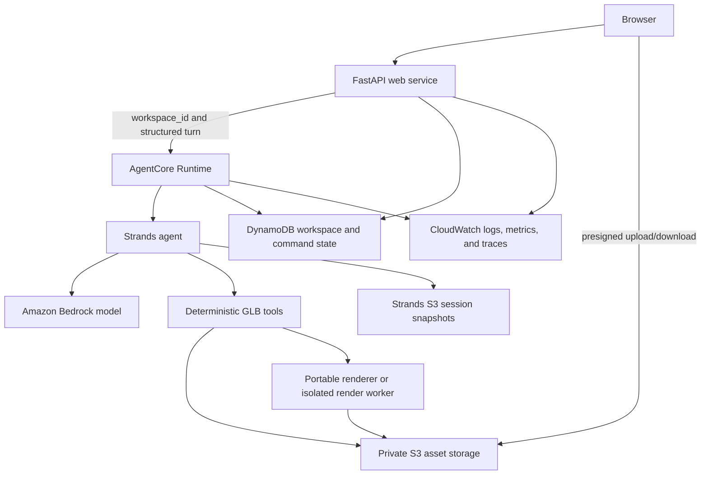

# Bedrock and Strands Deployment Runbook

**Status:** Approved procedure; Kimi and Claude Haiku 4.5 intake/full Strands workflows passed
through the least-privilege runtime role, while the browser matrix and cloud deployment remain open

**Last verified against official documentation:** 2026-08-29

**Milestone:** M9 hosted Bedrock conversation and deployment

Asset Shepherd already uses Strands as its orchestration layer. This runbook moves the two live
model boundaries from OpenAI to Amazon Bedrock, then moves filesystem-backed application state and
the agent runtime from one Windows workstation to AWS without changing the user/agent/tool authority
contract.

The migration has three independent proof gates:

1. **Bedrock provider gate:** the unchanged local product completes representative workflows using
   Bedrock and makes no OpenAI request.
2. **Cloud-portability gate:** every required job artifact, session, approval, and render can be
   recovered without relying on process memory or a workstation path.
3. **Remote-product gate:** the browser product completes upload through download against the
   remotely hosted agent with observable, bounded, restart-safe behavior.

Do not combine these gates into one debugging exercise. Keep the current local product runnable
until the remote-product gate passes.

## Execution status

- [x] Step 1.1 workstation inspection: AWS CLI v2.36.34 is installed per-user. The Codex process
  inherited an older PATH, so the current shell cannot resolve `aws`; a new terminal should.
- [x] Step 1.2 the bootstrap administrator identity is verified through the local
  `asset-shepherd-admin` profile; the separate least-privilege `asset-shepherd` role/profile is
  created and verified without making a paid model call. Do not publish the underlying IAM user.
- [x] Step 1.3 Kimi K2.5, Claude Haiku 4.5, Mistral Large 3, Qwen3 VL 235B, and Nova 2 Lite accept
  bounded calls in `us-east-1`; Kimi is the recommended selection (D077/D078).
- [x] Step 1.4 the user confirmed an AWS Budget zero-cost alert and $100 promotional-credit
  allocation. The alert is notification rather than a hard spending cap, and credit eligibility
  remains subject to the account's credit terms.
- [x] Step 2.1/2.2 Bedrock intake, workflow transport, short-term-token, and launcher implementation.
- [x] D074 Nova diagnostic: least-privilege connectivity, typed intake, and one complete local
  Strands approval-through-package workflow passed through native Bedrock Converse.
- [x] D077/D078 canonical `bedrock-converse` adapter and five-model allowlist. Kimi K2.5 and Claude
  Haiku 4.5 passed typed
  intake and the complete image/tool/approval/verification/package workflow; the upload UI persists
  a fail-closed per-asset model selection with usage hints.
- [x] One representative local browser loop reached verified packaging through Nova: intake and
  sensing succeeded, the first medium-reasoning turn exhausted its 8,192-token allowance, a
  low-reasoning retry produced only naming cleanup, explicit user correction produced an
  approval-gated proportional fit, and deterministic execution independently verified the final
  `1.22376 x 0.820321 x 0.268958 m` candidate grounded at `Y=0`. This qualifies Nova as a usable
  diagnostic path, not the default parity model or a completed browser matrix.
- [x] D075 selects App Runner as the first public FastAPI host beside private AgentCore, with
  ECS/Fargate retained only as a measured fallback. No remote resources have been deployed yet.
- [ ] Step 2.3 local all-Bedrock browser matrix. Kimi is the recommended model; the refreshed
  bootstrap session installed exact-resource runtime policies and all five choices now invoke
  through the least-privilege profile. Luna's optional Responses evaluation remains separately
  blocked by its one-time agreement.
- [ ] Step 3 cloud-portable state and artifacts.
- [ ] Step 4 deployable visual sensing.
- [ ] Step 5 AgentCore runtime.
- [ ] Step 6 remote web product.
- [ ] Step 7 operations and cleanup.
- [ ] Step 8 remote M9 acceptance.

## Controlling constraints

- Keep `workspace_id` as the per-asset conversation and session authority.
- Keep the Strands agent as the semantic orchestrator and the deterministic GLB tools as the
  measurement, bounded-mutation, authorization, and verification authority.
- Do not let chat text authorize a mutation. Consequential changes retain the exact structured
  Strands interrupt, action hash, and explicit user approval.
- Keep source files immutable. Every mutation creates a separately hashed candidate.
- Do not introduce a second conversational authority. AgentCore Memory is optional and is not part
  of the first deployment; Strands session snapshots remain authoritative.
- Do not put the interactive FastAPI/Jinja website inside the AgentCore invocation contract.
- Do not send GLB bytes through every model or AgentCore turn. Upload assets to private object
  storage and pass only a workspace-scoped reference plus its hash.
- Do not scatter a Bedrock model ID outside the reviewed capability registry or assume an old
  tutorial's region availability.
- Do not create paid resources or invoke a paid model before caller identity, region/model access,
  and a budget alert are confirmed.
- Stop for approval before architecture expected to cost more than $10 during development or more
  than $2 per idle day.
- Never commit credentials, account IDs, tokens, presigned URLs, or secret-bearing command output.

## Target deployment shape



The web service authenticates users and invokes AgentCore service-to-service. The browser does not
receive AWS credentials and does not invoke the private agent runtime directly.

### Local and remote execution are configurations of one product

Running `scripts/Start-AssetShepherd.ps1` does not deploy anything. It starts Uvicorn on the
selected workstation, by default at `http://127.0.0.1:8010`. Choosing `bedrock`,
`bedrock-converse`, or the legacy `bedrock-nova` alias changes only the remote inference provider
used by that local process. The local
FastAPI application, Strands orchestration, GLB tools, renderer, workspace files, and browser UI
remain on that workstation.

The AWS deployment uses the same application contracts with cloud-backed adapters:

| Concern | Local configuration | AWS configuration |
|---|---|---|
| Browser address | `http://127.0.0.1:8010` | App Runner HTTPS service URL or approved custom domain |
| FastAPI/Jinja web process | Local Uvicorn process | Stateless App Runner container |
| Workflow execution | Local Strands process | Private AgentCore Runtime invocation |
| Model inference | Bedrock over outbound HTTPS | Bedrock from the AgentCore execution role |
| GLBs, evidence, packages | Isolated local workspace directories | Private S3 workspace prefixes |
| Workspace and command state | Atomic local JSON plus locks | Conditional DynamoDB records |
| Strands snapshots | Workspace-local session storage | Workspace-scoped S3 session storage |

There are not separate local and cloud products. Provider, storage, session, and workflow-runtime
interfaces select the environment while typed state, authorization, tools, verification, and UI
behavior stay shared.

### Selected first web host

Use **AWS App Runner** for the first remote FastAPI deployment, packaged as a Linux container in a
private Amazon ECR repository. App Runner is selected over an initial ECS/Fargate web deployment
because it supplies a managed public HTTPS service and container rollout with less infrastructure
while the product has one web process. App Runner does not become a state authority: its filesystem
and instances are disposable, and all durable workspace data must already be in S3/DynamoDB before
the remote-product gate.

AgentCore remains a separate private runtime for the Strands workflow. The App Runner instance role
may invoke that runtime and access only the required S3/DynamoDB records. The browser receives
application sessions and short-lived exact-object transfer URLs, never AWS credentials. If a
compatibility spike proves App Runner cannot meet measured request-duration, startup, or cost
requirements, switching the web compute layer to ECS/Fargate requires a recorded decision but does
not change the application or agent contracts.

## Current implementation map

| Concern | Current implementation | Required migration |
|---|---|---|
| Workflow model | Capability-aware Bedrock Converse adapter with Kimi recommended and three bounded alternatives; Luna Responses and direct-OpenAI development adapters remain | Complete Kimi browser matrix and runtime-role policy |
| Intake model | Shared Converse constrained-tool adapter, Luna Responses, OpenAI development, and deterministic test adapters | Complete hosted Kimi browser evaluation after authentication renewal |
| Agent session | `SnapshotSessionManager` with `LocalFileStorage` under one workspace | Replace storage with Strands S3 session storage while retaining `workspace_id` |
| Workspace record | Atomic JSON files plus process-local locking | DynamoDB record with optimistic/conditional writes |
| Binary artifacts | Per-workspace local directories | Private S3 prefixes with hashes, lifecycle, and presigned transfer |
| Visual sensing | Four standardized Blender renders plus masks | Replace with a portable renderer or isolate rendering outside AgentCore |
| Interactive preview | Browser-local `<model-viewer>` | Retain; serve GLB URLs from authenticated/presigned object storage |
| Web application | FastAPI/Jinja/Uvicorn on localhost | Deploy independently from AgentCore through the simplest stable AWS web route |

## Step 1 — Workstation and AWS account preflight

**Purpose:** establish identity and availability without creating application infrastructure or
making model calls.

### 1.1 Workstation inspection

Run:

```powershell
Get-Command aws -ErrorAction SilentlyContinue
aws --version
```

If AWS CLI v2 is absent, install it from the official AWS distribution and open a new terminal.
Do not put access keys in the repository or a checked-in `.env` file.

If WinGet reports AWS CLI installed but `Get-Command aws` does not find it, open a fresh terminal
before reinstalling. A per-user WinGet installation updates the user PATH, but already-running
processes retain their older environment.

### 1.2 Dedicated profile

Prefer IAM Identity Center when the account provides it:

```powershell
aws configure sso --profile asset-shepherd
```

Otherwise configure a dedicated least-privilege development identity using the account's approved
credential method. Then verify exactly which account and principal will be used:

```powershell
aws sts get-caller-identity --profile asset-shepherd
aws configure get region --profile asset-shepherd
```

Do not paste the returned account number or credentials into project files.

The current `asset-shepherd-admin` profile is a bootstrap administrator session, not the
application runtime identity. The verified `asset-shepherd` role/profile is the runtime identity.
It may invoke only the exact allowlisted foundation models and Nova inference-profile resources,
inspect those resources, and generate/use short-term Bedrock bearer tokens when a Responses model
needs them. Do not attach broad Bedrock administration or long-term API-key permissions. Add each
model's exact `bedrock:InvokeModel` and `bedrock:InvokeModelWithResponseStream` resources only after
its administrator smoke gate passes.

### 1.3 Region and model capability

Choose a region in which the account can invoke a current multimodal, tool-capable Bedrock model.
Record the chosen region and model ID only in local environment configuration. Confirm model access
with the Bedrock model catalog and a bounded provider smoke test only after Step 1.4.

The recommended candidate is:

```text
Provider: Bedrock Converse
Logical model: Kimi K2.5
Bedrock region: us-east-1
Bedrock model ID: moonshotai.kimi-k2.5
API: Bedrock Runtime Converse
Application reasoning override: none
```

Kimi has passed typed intake, image evidence, sequential tools, native approval/resume, candidate
reassessment, and deterministic packaging. Claude Haiku 4.5 passed the same opt-in intake and full
Strands workflow through its US inference profile and remains an experimental speed/quality/cost
comparison. Mistral Large 3 and Qwen3 VL 235B passed bounded typed tool and image probes and remain
experimental. Nova passed the full workflow but needed more user correction in the browser case.
The server allowlist and capability registry, not an arbitrary environment or posted value,
control the models exposed to users.

Required model behavior:

- image input for standardized source/candidate renders;
- sequential tool calling with parallel calls disabled or behaviorally constrained;
- the existing typed tool schemas;
- sufficiently large context for the system contract, Job Contract, and bounded tool evidence;
- predictable structured intake output; and
- an explicit application-layer safety plan without assuming one Guardrails integration behaves
  identically across every allowlisted model and API.

Luna remains an optional Responses candidate outside the Converse UI allowlist. Use the current
model-access API to distinguish IAM from its account agreement state:

```powershell
aws bedrock get-foundation-model-availability `
  --model-id openai.gpt-5.6-luna `
  --profile asset-shepherd-admin `
  --region us-east-1
```

`authorizationStatus=AUTHORIZED`, `entitlementAvailability=AVAILABLE`, and
`regionAvailability=AVAILABLE` rule out the usual IAM/region causes. An
`agreementAvailability.status=NOT_AVAILABLE` result means model access itself has not been created.
The administrator must review the applicable EULA before selecting the model in the Bedrock model
catalog or using `ListFoundationModelAgreementOffers` and `CreateFoundationModelAgreement`.
Agreement permissions belong to the one-time administrator path, never the application runtime
role. Official procedure:
<https://docs.aws.amazon.com/bedrock/latest/userguide/model-access.html>.

Nova 2 Lite remains the lower-cost diagnostic. It uses `us.amazon.nova-2-lite-v1:0` through the
same canonical Converse adapter. Passing Nova does not establish Kimi behavior or Luna/xhigh parity.

Grok 4.6 is a deferred Responses candidate, not a working fallback. On 2026-08-29 the model-access
API reported every Grok availability field as available and both `us.xai.grok-4.6` and
`global.xai.grok-4.6` as active, but bounded Responses and Converse calls under the administrator
profile both returned `AccessDeniedException` stating that the model is unavailable for the
account. Treat a successful invocation—not catalog metadata—as its access gate. Do not add Grok to
the maintained provider surface until that gate passes.

### 1.4 Cost checkpoint

Create or confirm an AWS Budget/billing alert before the first paid call. Set conservative
development thresholds and retain evidence that the alert exists without committing account data.

**Step 1 gate:** AWS CLI v2 works, the `asset-shepherd` identity is known, one region/model candidate
is recorded locally, and a budget alert exists. No application resource is required yet.

## Step 2 — Remove the direct OpenAI API from the production execution path

### 2.1 Bedrock semantic intake

Use `BedrockConverseTargetIntakeAnalyzer` behind the existing `TargetIntakeAnalyzer` protocol. It
must produce `TargetIntakeInference`, pass the same Pydantic validation and confidence gates, and
retain provider/model provenance. Normalize the generated schema to the portable forced-tool
subset without weakening server-side validation. Reject absent, malformed, or repeated submissions.

The optional D071 Luna path continues to use its constrained Responses tool adapter. Both paths
produce the same target contract; neither may silently fall back to direct OpenAI.

The deterministic intake implementation remains the zero-network test fallback. The OpenAI adapter
may remain an optional development adapter, but production startup must not require an OpenAI key.

### 2.2 Bedrock workflow configuration

Use explicit local environment values:

```powershell
$env:ASSET_SHEPHERD_INTAKE_PROVIDER = 'bedrock-converse'
$env:ASSET_SHEPHERD_MODEL_PROVIDER = 'bedrock-converse'
$env:ASSET_SHEPHERD_MODEL_ID = 'moonshotai.kimi-k2.5'
$env:ASSET_SHEPHERD_AWS_REGION = 'us-east-1'
$env:AWS_PROFILE = 'asset-shepherd'
```

Update the launcher so Bedrock configuration does not pass through the saved-OpenAI-key path. Keep
model ID, region, retry, timeout, token, and reasoning controls explicit and secret-free.

The canonical provider uses the regional Bedrock Runtime Converse API with normal AWS session
credential resolution. It must not reuse the direct OpenAI API endpoint or require a long-term
Bedrock key. The upload UI may change only the allowlisted model ID; region and credentials remain
deployment-owned settings.

### 2.3 Behavioral parity evaluation

Implementation status: the model-neutral Converse adapter, persisted selector, and offline
acceptance tests are complete. Kimi and Claude Haiku 4.5 passed both live integration tests through
the least-privilege runtime role. Exact invoke resources are installed for every visible choice; do
not begin Step 3 until the bounded hosted browser matrix succeeds.

From a fresh PowerShell session:

```powershell
$env:AWS_PROFILE = 'asset-shepherd'
$env:ASSET_SHEPHERD_INTAKE_PROVIDER = 'bedrock-converse'
$env:ASSET_SHEPHERD_MODEL_PROVIDER = 'bedrock-converse'
$env:ASSET_SHEPHERD_MODEL_ID = 'moonshotai.kimi-k2.5'
$env:ASSET_SHEPHERD_AWS_REGION = 'us-east-1'
$env:ASSET_SHEPHERD_RUN_LIVE = '1'
Remove-Item Env:OPENAI_API_KEY -ErrorAction SilentlyContinue

uv run pytest -q `
  tests/test_intake_analyzer.py::test_opt_in_live_bedrock_target_intake `
  tests/test_agent.py::test_opt_in_live_strands_provider_workflow
```

If the runtime role reports access denied while the administrator smoke passes, add only the exact
allowlisted model resources. Do not attach broad Bedrock access or add a direct-OpenAI production
fallback. Luna can be retried separately after its agreement becomes available.

To exercise the already-authorized Nova diagnostic instead, change both providers together and use
Nova's bounded medium reasoning setting:

```powershell
$env:AWS_PROFILE = 'asset-shepherd'
$env:ASSET_SHEPHERD_INTAKE_PROVIDER = 'bedrock-converse'
$env:ASSET_SHEPHERD_MODEL_PROVIDER = 'bedrock-converse'
$env:ASSET_SHEPHERD_INTAKE_MODEL = 'us.amazon.nova-2-lite-v1:0'
$env:ASSET_SHEPHERD_MODEL_ID = 'us.amazon.nova-2-lite-v1:0'
$env:ASSET_SHEPHERD_AWS_REGION = 'us-east-1'
$env:ASSET_SHEPHERD_INTAKE_REASONING = 'medium'
$env:ASSET_SHEPHERD_WORKFLOW_REASONING = 'medium'
$env:ASSET_SHEPHERD_RUN_LIVE = '1'
Remove-Item Env:OPENAI_API_KEY -ErrorAction SilentlyContinue

uv run pytest -q `
  tests/test_intake_analyzer.py::test_opt_in_live_bedrock_target_intake `
  tests/test_agent.py::test_opt_in_live_strands_provider_workflow
```

Nova's provider-facing intake schema is normalized to its documented tool-schema subset, while the
same strict Pydantic contract remains the server authority. The trial intentionally rejects Nova
high reasoning because the live service requires `maxTokens` to be unset at high effort; medium is
the documented agentic-workflow setting and retains 4,096/8,192 output limits.

Run the current local browser product through Bedrock before changing storage or hosting. Cover:

1. clean accept-as-is;
2. ordinary scale/naming repair with approval;
3. ambiguous orientation where the model asks or preserves orientation;
4. disconnected-component selection with user revision;
5. a Refine turn requiring a new consequential action and approval;
6. rejection and subsequent feedback;
7. inappropriate-content refusal; and
8. visual reassessment using source, isolated candidate, and shared-scale comparison renders.

Capture tool calls, typed assessments, provider/model identity, latency, token metrics when reported,
and approximate cost per completed run. Do not publish private reasoning tokens.

**Step 2 gate:** intake and workflow use Bedrock, `OPENAI_API_KEY` is absent, representative D036
cases pass, and the normal offline suite remains green.

## Step 3 — Make state and artifacts cloud-portable

### 3.1 S3 layout

Create one private bucket only after reviewing its region, encryption, public-access block, CORS,
and lifecycle configuration. Use non-guessable workspace IDs and bounded prefixes such as:

```text
workspaces/<workspace_id>/source/source.glb
workspaces/<workspace_id>/iterations/<iteration_id>/candidate.glb
workspaces/<workspace_id>/evidence/<assessment_id>/...
workspaces/<workspace_id>/packages/<package_id>/result.zip
sessions/<workspace_id>/...
```

Store hashes and object version/ETag metadata in the workspace record. Presigned URLs must be
short-lived and scoped to one exact object operation.

### 3.2 Strands session storage

Replace `LocalFileStorage` with Strands S3 session storage. Preserve the same `workspace_id`, stable
agent ID, and exact interrupt-resume behavior. Define deletion and retention for session messages;
do not add AgentCore Memory in this phase.

### 3.3 DynamoDB workspace state

Move the durable workspace record, current phase, iteration lineage, pending interrupt metadata,
processed command IDs, gallery slot, retention marker, and object references to DynamoDB. Use a
monotonic record version and conditional writes so duplicate or racing callbacks cannot execute or
package twice.

**Step 3 gate:** a process can be killed and replaced at intake, approval, repair, refinement, and
completion; the exact workspace resumes from S3/DynamoDB without duplicate mutation or packaging.

## Step 4 — Make standardized visual sensing deployable

The current agent-required renderer invokes locally installed Blender. Resolve this before moving
the GLB tools into AgentCore.

### Preferred route

Package a lightweight Linux/ARM64-capable GLB renderer that produces the existing four
coordinate-labeled 512 px views, masks, camera contract, shared-scale comparison views, and framing
quality metrics. It must preserve material/texture appearance well enough for the D036 visual gate.

### Bounded fallback

If the lightweight renderer misses its written acceptance test, propose—do not silently create—an
x86 ECS/Fargate render worker containing headless Blender. Keep it private, job-scoped, time-limited,
and accessible only through exact S3 inputs/outputs. Measure image size, cold-start time, and cost
before acceptance.

**Step 4 gate:** a clean Linux environment generates nonblank, unclipped, reproducible source,
candidate, and shared-scale views with no workstation path or interactive desktop dependency.

## Step 5 — Deploy the Strands agent to AgentCore Runtime

Create an AgentCore entry point accepting a structured invocation with `workspace_id`, authenticated
actor identity, command ID, and the new user turn. It returns structured workflow state rather than
HTML. Use the same session ID for every turn in one asset workspace.

Choose direct code deployment only if all native dependencies and the renderer pass its runtime
compatibility spike. Otherwise build an ARM64 Linux container exposing AgentCore's required port
8080, `GET /ping`, and `POST /invocations` contract.

The runtime execution role receives least-privilege access to:

- the selected Bedrock model;
- only the required S3 bucket prefixes;
- only the workspace DynamoDB table/indexes;
- CloudWatch logs/traces; and
- any explicitly approved render worker invocation.

Do not make the AgentCore endpoint public. The web service invokes it using service identity and
derives the asset workspace from the authenticated user/session, not arbitrary browser input.

**Step 5 gate:** a direct AgentCore invocation completes a multi-turn inspect → approval interrupt
→ resume → repair → reassess → package flow, with visible logs/traces and exactly-once semantics.

## Step 6 — Deploy the interactive web product

Deploy the existing FastAPI/Jinja application to **AWS App Runner** after a small container
compatibility spike. Keep ECS/Fargate as the measured fallback, not a parallel implementation.

### 6.1 Container compatibility

- Add one production Linux container definition that installs only declared project/runtime
  dependencies and starts Uvicorn on the port supplied by the hosting environment.
- Run that exact image locally with Nova and complete upload, approval, refinement, and download.
- Prove the process makes no durability assumption about its container filesystem.
- Keep visual sensing behind the Step 4 portable-renderer boundary; do not install desktop Blender
  in the App Runner web container.

### 6.2 App Runner service

- Push the accepted image to one private ECR repository.
- Create one App Runner service with manual deployment for the initial gate, a public HTTPS endpoint,
  health check, bounded CPU/memory, and an instance role containing only the required
  AgentCore/S3/DynamoDB/CloudWatch permissions.
- Supply non-secret model, region, bucket, table, retention, and runtime identifiers through service
  configuration. Use AWS-managed identity/secret mechanisms for anything sensitive.
- Keep at least one explicit version/tag and rollback target until the remote gate passes.

### 6.3 Browser and service boundaries

The web service owns browser routes, user authentication, gallery authorization, presigned transfer,
and AgentCore invocation. It does not own model reasoning or bypass the structured workflow state.
Keep gallery capacity and workspace isolation exactly as in the local product.

For the competition deployment, provide either logged-out access or one documented test user.
Prefer web authentication plus service-to-service SigV4 invocation; do not distribute AWS
credentials to the browser.

The first successful deployment receives an AWS-managed `awsapprunner.com` HTTPS URL. A custom
domain is optional and comes only after the default URL passes the full acceptance matrix. The local
launcher continues to serve `127.0.0.1`; it never redirects to or updates the remote service.

**Step 6 gate:** a fresh user can upload, leave, return through the gallery, approve/refine, and
download from the remote URL. Restarting or replacing the App Runner instance does not lose or
duplicate any workspace state, mutation, decision, or package.

## Step 7 — Guardrails, observability, retention, and cost

- Apply the existing on-topic/content contract at the model boundary and configure a Bedrock
  Guardrail after verifying that it yields the product's concise refusal behavior.
- Instrument the agent and web request with a shared workspace/turn correlation ID, excluding raw
  GLB contents, secrets, and private reasoning.
- Enable AgentCore/CloudWatch metrics and the traces needed to see model calls and public tool-use
  events.
- Alarm on error rate, invocation duration, throttling, S3 growth, and estimated spend.
- Apply S3 lifecycle and DynamoDB retention cleanup consistent with the documented seven-day private
  workspace policy.
- Test deletion of workspace assets, session state, metadata, and generated URLs.

**Step 7 gate:** the team can diagnose one failed run, prove cleanup, and bound idle and per-run
cost without inspecting secret-laden raw logs.

## Step 8 — Remote M9 acceptance

Run at least these remote cases from a clean browser:

1. valid accept-as-is asset;
2. malformed upload stopped before model invocation;
3. consequential repair approved;
4. consequential repair rejected and refined;
5. disconnected-component review and surviving-iteration promotion;
6. application/runtime restart while approval is pending;
7. duplicate approval callback;
8. model or renderer transient failure with understandable recovery; and
9. completed download whose GLB and evidence package independently reload and match recorded hashes.

Verify that each factual agent claim maps to recorded evidence, no chat text authorizes mutation,
the source object remains unchanged, all user-visible files are intelligibly named, and the current
offline suite still passes.

**Step 8 gate:** every M9 gate in `PROJECT_CONTRACT.md` passes. Stop for mandatory checkpoint 3
before public release or submission work.

## Rollback and fallback

- A failed Bedrock evaluation returns development to the working OpenAI adapter without changing
  deterministic tools or persisted contracts.
- A failed AgentCore spike may be replaced only by an explicitly approved Strands/Bedrock deployment
  on a conventional AWS compute service; the architecture change must be recorded.
- A failed remote web deployment must not remove the working local path.
- AWS resources created for a rejected route must be inventoried and deleted before trying another
  route.

## Official references

- [Strands Amazon Bedrock provider](https://strandsagents.com/docs/user-guide/concepts/model-providers/amazon-bedrock/)
- [Strands session management and S3 storage](https://strandsagents.com/docs/user-guide/concepts/agents/session-management/)
- [AgentCore Runtime operation](https://docs.aws.amazon.com/bedrock-agentcore/latest/devguide/runtime-how-it-works.html)
- [AgentCore direct code deployment](https://docs.aws.amazon.com/bedrock-agentcore/latest/devguide/runtime-get-started-code-deploy.html)
- [AgentCore Runtime permissions](https://docs.aws.amazon.com/bedrock-agentcore/latest/devguide/runtime-permissions.html)
- [AgentCore quotas](https://docs.aws.amazon.com/bedrock-agentcore/latest/devguide/bedrock-agentcore-limits.html)
- [AgentCore authentication](https://docs.aws.amazon.com/bedrock-agentcore/latest/devguide/runtime-oauth.html)
- [AgentCore observability](https://docs.aws.amazon.com/bedrock-agentcore/latest/devguide/observability-configure.html)
- [AWS App Runner overview](https://docs.aws.amazon.com/apprunner/latest/dg/what-is-apprunner.html)
- [Create an App Runner service](https://docs.aws.amazon.com/apprunner/latest/dg/manage-create.html)
- [App Runner service from an ECR image](https://docs.aws.amazon.com/apprunner/latest/dg/service-source-image.html)
- [App Runner default and custom domains](https://docs.aws.amazon.com/apprunner/latest/dg/manage-custom-domains.html)
