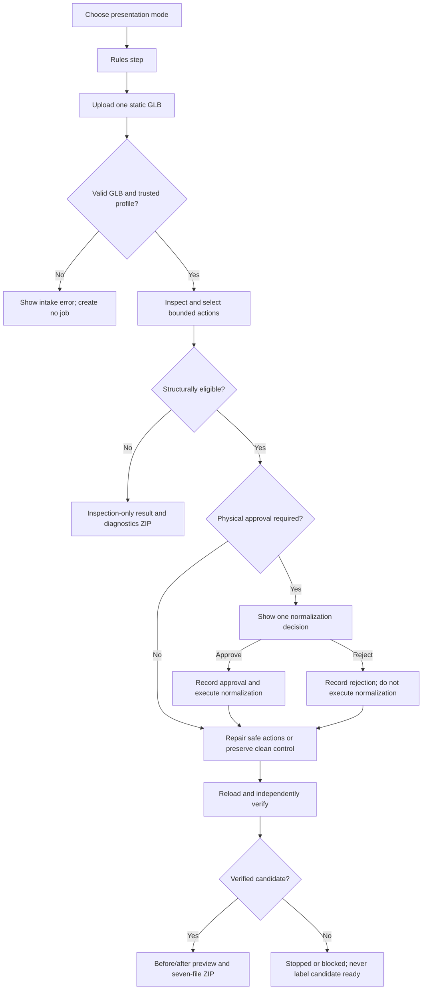

# Asset Shepherd Web Design and Flow

This document describes the local web product after the clarified two-column application-shell and
single-step workspace redesign. It is a handoff snapshot, not a proposal for expanded scope.

## Product mental model

Asset Shepherd is a guided intake workflow for one static GLB at a time:

```text
Choose a presentation mode in the persistent left navigation pane
  -> Rules: choose an immutable preset or customize a supported copy
  -> Upload: select the actual GLB
  -> Inspect: review source facts and policy findings
  -> Decide: approve or reject one physical normalization, if needed
  -> Download: review verification, compare, and retrieve the package
```

The validation-rule choice and file upload are deliberately separate:

- **Validation rules** select the target size, conventions, and limits against which the asset is
  judged. They do not select a model. Repository presets are immutable, and a custom copy is
  validated and frozen before the job starts.
- **GLB upload** selects the user's actual 3D model. Asset Shepherd works on a copied job artifact
  and does not mutate the uploaded source file.

## Design principles already implemented

1. **Five persistent modes.** A dedicated left navigation pane gives the three audience styles
   prominent full-width icon tiles. Help me choose and Advanced user remain visible as smaller
   secondary tiles in the same pane. Hover and focus hints explain each icon.
2. **One product, three audience explanations.** Every audience route uses the same profiles, inspection,
   Strands interrupt, deterministic repair engine, verification, and output package. Only the
   framing and labels change. Help is a chooser; Advanced is a direct policy-oriented presentation
   of that same workflow.
3. **One visible workflow step.** The workspace renders only Rules or Upload during intake and only
   Inspect, Decide, or Download for a job. Evidence never competes with the current task.
4. **One consequential decision.** Scale, upright orientation, and grounding are grouped into one
   reversible physical-normalization approval. Safe display-name repairs remain separate.
5. **Measured evidence over agent prose.** Visible facts and state come from deterministic job
   data. The model cannot invent repairs or declare success.
6. **Preserve the source and artistic content.** The product does not perform topology, UV,
   material, texture, animation, or speculative artistic edits.

## Information architecture

| Route | Audience framing | Primary question |
|---|---|---|
| `/` | Role chooser | Which best describes you? |
| `/stories/game-developer` | Game developer | Is this asset ready to enter my game? |
| `/stories/artist` | 3D artist | What changes, and what remains untouched? |
| `/stories/technical-artist` | Technical artist | What does the versioned policy require? |
| `/stories/advanced` | Advanced user | Which supported target rules should be frozen? |
| `/jobs/{job_id}?view=inspect\|decide\|download` | Shared job workspace | What does this workflow step require? |

The three audience routes are functionally equivalent:

- **Game developer:** emphasizes import blockers, one physical decision, and an import-ready
  candidate.
- **3D artist:** emphasizes reviewability and preservation of geometry, materials, textures, and
  the untouched source.
- **Technical artist:** emphasizes versioned policy, bounded authorization, verification, and an
  auditable evidence trail.

The persistent style pane is separate from the workspace workflow navigator. Intake exposes
**Rules -> Upload**. A job exposes **Inspect -> Decide -> Download**. The full technical execution
sequence remains available under structured detail as **Intake -> Inspect -> Plan -> Approve ->
Repair -> Verify -> Package**.

## End-to-end flow and states



### Intake

The intake is one workspace focus area with a two-step navigator. Only the **Rules** panel is shown
at first. No profile is selected by default. The user must explicitly choose one of the
repository-owned versioned policy presets before the interface reveals the **Upload** panel:

- **Unreal Indie Robot** — 1.8 m character-scale static mesh.
- **Small Stylized Static Mesh** — 0.9–1.5 m compact stylized asset.

Each preset visibly summarizes target height/tolerance, orientation and grounding, naming, budgets,
and authorization behavior. **Review rules** remains collapsed and contains every active
`ProjectProfile` parameter plus the preset version and canonical hash.

**Customize a copy** is a collapsed advanced control below the presets. It allows only supported
target-state fields already enforced by the deterministic core: height/tolerance, Y-up and ground
contact/tolerance, an engine-compatible naming pattern, and triangle/material/texture budgets. It
does not expose transforms. Automatic safe-name handling, grouped physical approval, vertical
inference, uniqueness policy, verification invariants, unsupported repair domains, engine/type,
and source preservation remain fixed.

The user can return from Upload to Rules before submission. Upload accepts one GLB 2.0 static mesh
up to 50 MB. The server checks the extension, GLB magic, size, and trusted profile identifier before
creating an isolated job.

The resolved profile is schema-validated, copied into the isolated job, and identified by a frozen
profile ID and canonical SHA-256. A custom job additionally records the immutable base preset and
only values that differ as explicit overrides. Rules cannot be edited in place after upload; the
user returns to the intake and creates a new inspection/job.

### Pending approval

When a physical normalization needs authorization, the workspace opens **Decide** and shows only:

- one decision card with the consequence and before/expected-after height;
- **Approve** and **Reject** actions tied to the exact Strands interrupt;
- a collapsed “Why this is proposed” section with component confidence and evidence;

The source preview, all findings, and their rule provenance remain in **Inspect**, one explicit
workflow step away. Approve and Reject remain tied to the exact Strands interrupt.

Approval executes only the selected registered action. Rejection is durable evidence: the
normalization is not executed, unresolved physical findings remain explicit, and policy-safe name
repairs may still be packaged.

### Completed, blocked, and error results

- A verified result opens **Download** and shows the role-specific candidate label, verification
  state, before/after 3D previews, and result ZIP download.
- A structurally unsupported asset produces an inspection-only diagnostic package without
  `repaired.glb` and is not called ready.
- An execution or verification error stops safely and does not mark an output ready.
- A clean compliant asset completes without an approval and without unnecessary content mutation.

The successful ZIP contains exactly:

```text
repaired.glb
inspection.json
repair_plan.json
decisions.json
verification.json
provenance.json
report.md
```

## Attention budget by page state

| Page or state | Primary focus areas | Count |
|---|---|---:|
| Help me choose | Style chooser workspace | 1 |
| Any intake | Current Rules or Upload workspace step | 1 |
| Inspect | Source preview and inspection evidence inside one step | 1 |
| Decide | Pending or recorded authorization inside one step | 1 |
| Download | Result, comparison, and collapsed verification inside one step | 1 |

Inspect contains measured metrics, grouped findings, policy-rule provenance, and a collapsed
seven-stage execution detail. Download contains the result and comparison plus collapsed
verification checks, remaining warnings, and tool/interrupt/correction counts. Every policy-caused
finding cites the frozen profile and exact active parameter value that triggered it.

## Visual system

- Dark charcoal/green “workshop” background with warm off-white text.
- The application frame is a visible two-by-two grid: placeholder `LOGO` cell above the navigation
  pane, title cell above the workspace, and aligned horizontal and vertical dividers.
- The desktop navigation pane is 248–320 px wide. Its three audience tiles are primary; Help me
  choose and Advanced user are smaller secondary tiles. At compact widths it becomes a 64–76 px
  icon pane but stays on the left.
- Role accents distinguish context without changing behavior: amber for game developers/help,
  teal for artists, blue for technical artists, and violet for advanced mode.
- The only page title is `Asset Shepherd -- [current style]` in the workspace header.
- Content uses the full remaining workspace width, with one bordered workflow panel at a time.
- Desktop Rules uses two policy columns; inspection and approval use context-appropriate two-column
  arrangements. Each becomes one column at narrow widths without moving the mode pane.
- Motion is minimal, and reduced-motion preferences are honored.
- Interactive GLB previews use pinned `<model-viewer>` 4.3.1 with camera controls, neutral
  environment, and a slow rotation.

## Runtime and trust boundaries

- The default local workflow uses the real Strands loop with a scripted zero-network provider. It
  does not require model credentials or a model/network request.
- Uploaded files are copied below `build/web/jobs/{job_id}`. Completed artifacts remain there, but
  active job state is in memory. The resolved `profile.json` beside the upload is a job snapshot;
  repository presets are never edited.
- Refreshing the page preserves the job while the local server is running. Restarting the server
  ends the in-memory approval session.
- Only a verified candidate is served from the repaired-asset route.
- The 3D viewer component is fetched from Google's CDN, so preview rendering has an external browser
  dependency even though the agent workflow itself is local.

## Current validation evidence

- Fourteen web acceptance tests cover the three role routes plus Advanced mode,
  approve/resume/download, explicit Inspect/Decide/Download views, clean completion, invalid GLB
  rejection, unsupported inspection-only packaging, source preservation, exact ZIP contents,
  immutable presets, schema-validated custom copies, frozen policy provenance, rule citations,
  new-job semantics, and the one-step focus-area budget.
- Server-rendered acceptance proves that each job response contains exactly one workflow panel;
  intake renders Rules initially and keeps Upload hidden until the client-side transition.
- The persistent pane contains exactly three primary style tiles and two secondary guidance tiles,
  all with native title text and visible hover/focus hints. Every route emits the exact dynamic
  `Asset Shepherd -- [style]` title.
- Live browser review completed the approved broken-fixture workflow from Decide through Download,
  inspected all three job views, and rendered Help, Rules, Upload, Inspect, Decide, and Download at
  desktop width. A narrow-width pass found and fixed one grid min-content overflow; the corrected
  document has no horizontal overflow, keeps the navigation pane on the left, and contains one
  focus area and one workflow panel. A second live review after the frame clarification measured
  matching 96 px logo/title cells and a 320 px desktop navigation pane; the compact breakpoint
  measured matching 72 px logo/title cells, a 76 px icon pane, and zero horizontal overflow. No
  application console error or warning was observed.

## Known limitations

- This is a local hackathon product, not a multi-user or durable hosted service.
- Job state is not restored after a server restart.
- Only static GLB input and two trusted profiles are exposed.
- Custom copies are job-scoped; there is no reusable policy library or multi-user policy manager.
- Unsupported rigs, animation, morph targets, and ambiguous structures are inspected and blocked,
  not silently repaired.
- Unreal/AWS deployment, identity, storage, and durable orchestration are not implemented.
- The preview is evidence for human review, not a substitute for independent Blender/Unreal import
  validation.

## Next contracted steps

This presentation change does not alter milestone priority. After this web pass is accepted, work
should remain within the existing validation and deployment milestones:

1. **Review this handoff and the Shader Lantern visual checkpoint.** Confirm that the current role
   framing and rules/upload explanation are understandable enough to freeze while validation work
   continues. Shader Lantern preserved its exported content, but the source GLB is opaque and
   non-emissive; Tripo preview-only glass/glow must not be claimed as exported content.
2. **Complete RW2 in order.** Freeze the one-batch Debug Beetle generation card, obtain and register
   its untouched GLB and provenance, and complete its blind baseline. Do not begin Cloudforge
   Workbench until that batch is complete.
3. **Complete the minimum four-asset flock.** Repeat the contracted registration and blind baseline
   for Cloudforge Workbench.
4. **Run RW3 controlled variants.** Apply the six frozen realistic mutations across three registered
   real assets and record detection, repair, verification, preservation, and evidence completeness.
5. **Close the RW4 three-way gate.** Produce one human-cleaned Blender reference with an intervention
   log and manual time, then compare raw, Asset Shepherd, and human arms independently in Blender and
   the isolated Unreal project.
6. **Unblock M9 before paid-provider work.** Install/configure the AWS CLI, confirm a dedicated
   `asset-shepherd` profile, Bedrock region/model access, and a budget alert. No paid call or cloud
   resource should be created before those user-owned controls exist.
7. **Finish M10 evidence and claims.** Consolidate corpus metrics and the demo/failure story. Keep
   public performance and quality claims prohibited until the validation gates pass.

## Implementation map

- Route behavior and shared story definitions: `src/asset_shepherd/web.py`
- Canonical policy hashing and rule citations: `src/asset_shepherd/profile_policy.py`
- Persistent navigation pane: `src/asset_shepherd/templates/_mode_rail.html`
- Help chooser and shared audience workspace: `src/asset_shepherd/templates/index.html` and
  `src/asset_shepherd/templates/story.html`
- Rules/upload intake: `src/asset_shepherd/templates/_intake_form.html`
- Job, approval, preview, result, and evidence states: `src/asset_shepherd/templates/job.html`
- Visual system and responsive rules: `src/asset_shepherd/static/app.css`
- Browser behavior: `src/asset_shepherd/static/app.js`
- Web acceptance contract: `tests/test_web.py`
