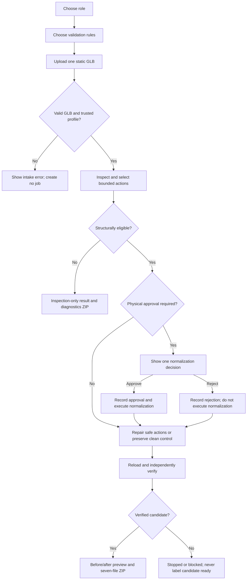

# Asset Shepherd Web Design and Flow

This document describes the local web product after the explicit validation-rules intake and D013
versioned policy enhancement. It is a handoff snapshot, not a proposal for expanded scope.

## Product mental model

Asset Shepherd is a guided intake workflow for one static GLB at a time:

```text
Choose a role
  -> choose an immutable preset or customize a supported copy
  -> upload the actual GLB
  -> inspect
  -> approve or reject one physical normalization, if needed
  -> independently verify
  -> preview and download the evidence package
```

The validation-rule choice and file upload are deliberately separate:

- **Validation rules** select the target size, conventions, and limits against which the asset is
  judged. They do not select a model. Repository presets are immutable, and a custom copy is
  validated and frozen before the job starts.
- **GLB upload** selects the user's actual 3D model. Asset Shepherd works on a copied job artifact
  and does not mutate the uploaded source file.

## Design principles already implemented

1. **Role first.** The first screen asks only, “Which best describes you?”
2. **One product, three explanations.** Every audience route uses the same profiles, inspection,
   Strands interrupt, deterministic repair engine, verification, and output package. Only the
   framing and labels change.
3. **No more than three primary focus areas.** Evidence is progressively disclosed instead of
   competing with the current task.
4. **One consequential decision.** Scale, upright orientation, and grounding are grouped into one
   reversible physical-normalization approval. Safe display-name repairs remain separate.
5. **Measured evidence over agent prose.** Visible facts and state come from deterministic job
   data. The model cannot invent repairs or declare success.
6. **Preserve the source and artistic content.** The product does not perform topology, UV,
   material, texture, animation, or speculative artistic edits.

## Information architecture

| Route | Audience framing | Primary question |
|---|---|---|
| `/` | Role chooser | Which best describes you? |
| `/stories/game-developer` | Game developer | Is this asset ready for my game? |
| `/stories/artist` | 3D artist | What will change in my work? |
| `/stories/technical-artist` | Technical artist | Does this asset meet project policy? |
| `/jobs/{job_id}` | Shared job experience | What needs a decision, and is the result verified? |

The three audience routes are functionally equivalent:

- **Game developer:** emphasizes import blockers, one physical decision, and an import-ready
  candidate.
- **3D artist:** emphasizes reviewability and preservation of geometry, materials, textures, and
  the untouched source.
- **Technical artist:** emphasizes versioned policy, bounded authorization, verification, and an
  auditable evidence trail.

Each intake reduces the public workflow to **Inspect -> Decide -> Download**. The full technical
rail remains available as **Intake -> Inspect -> Plan -> Approve -> Repair -> Verify -> Package**.

## End-to-end flow and states



### Intake

The intake has two focus areas: the audience question and one upload card. No profile is selected by
default. The user must explicitly choose one of the repository-owned versioned policy presets
before uploading:

- **Unreal Indie Robot** — 1.8 m character-scale static mesh.
- **Small Stylized Static Mesh** — 0.9–1.5 m compact stylized asset.

Each preset visibly summarizes target height/tolerance, orientation and grounding, naming, budgets,
and authorization behavior. **Review rules** remains collapsed and contains every active
`ProjectProfile` parameter plus the preset version and canonical hash.

**Customize a copy** is a collapsed advanced control below the presets. It allows only supported
target-state fields already enforced by the deterministic core: height/tolerance, Y-up and ground
contact/tolerance, an engine-compatible naming pattern, and triangle/material/texture budgets. It
does not expose transforms. Automatic safe-name handling, grouped physical approval, vertical
inference, uniqueness policy, verification invariants, unsupported repair domains, engine/type,
and source preservation remain fixed.

The upload accepts one GLB 2.0 static mesh up to 50 MB. The server checks the extension, GLB magic,
size, and trusted profile identifier before creating an isolated job.

The resolved profile is schema-validated, copied into the isolated job, and identified by a frozen
profile ID and canonical SHA-256. A custom job additionally records the immutable base preset and
only values that differ as explicit overrides. Rules cannot be edited in place after upload; the
user returns to the intake and creates a new inspection/job.

### Pending approval

When a physical normalization needs authorization, the page shows:

- one decision card with the consequence and before/expected-after height;
- **Approve** and **Reject** actions tied to the exact Strands interrupt;
- a collapsed “Why this is proposed” section with component confidence and evidence;
- the source preview; and
- collapsed technical details.

Approval executes only the selected registered action. Rejection is durable evidence: the
normalization is not executed, unresolved physical findings remain explicit, and policy-safe name
repairs may still be packaged.

### Completed, blocked, and error results

- A verified result shows the role-specific candidate label, verification state, before/after 3D
  previews, and the result ZIP download.
- A structurally unsupported asset produces an inspection-only diagnostic package without
  `repaired.glb` and is not called ready.
- An execution or verification error stops safely and does not mark an output ready.
- A clean compliant asset completes without an approval and without unnecessary content mutation.

The successful ZIP contains exactly:

```text
repaired.glb
inspection.json
repair_plan.json
decisions.json
verification.json
provenance.json
report.md
```

## Attention budget by page state

| Page or state | Primary focus areas | Count |
|---|---|---:|
| Role chooser | Question; role choices | 2 |
| Any role intake | Role question; rules/upload card | 2 |
| Awaiting approval | Decision; source preview; technical details | 3 |
| Verified result | Result/download; before/after preview; technical details | 3 |
| Blocked or failed | Result; source preview; technical details | 3 |

Technical details are collapsed by default and contain measured metrics, all seven stages, grouped
findings, verification checks and remaining warnings, and tool/interrupt/correction counts. Every
policy-caused finding cites the frozen profile and the exact active parameter value that triggered
it.

## Visual system

- Dark charcoal/green “workshop” background with warm off-white text.
- Role accents distinguish context without changing behavior: amber for game developers, teal for
  artists, and blue for technical artists.
- The page-leading question is intentionally oversized; supporting copy and controls are compact.
- Cards use restrained borders and spacing rather than dashboard-style panel density.
- Desktop intake uses two columns; it collapses for narrow screens at 820 px and tightens again at
  620 px.
- Motion is minimal, and reduced-motion preferences are honored.
- Interactive GLB previews use pinned `<model-viewer>` 4.3.1 with camera controls, neutral
  environment, and a slow rotation.

## Runtime and trust boundaries

- The default local workflow uses the real Strands loop with a scripted zero-network provider. It
  does not require model credentials or a model/network request.
- Uploaded files are copied below `build/web/jobs/{job_id}`. Completed artifacts remain there, but
  active job state is in memory. The resolved `profile.json` beside the upload is a job snapshot;
  repository presets are never edited.
- Refreshing the page preserves the job while the local server is running. Restarting the server
  ends the in-memory approval session.
- Only a verified candidate is served from the repaired-asset route.
- The 3D viewer component is fetched from Google's CDN, so preview rendering has an external browser
  dependency even though the agent workflow itself is local.

## Current validation evidence

- The full repository gate currently passes: 54 tests passed and the opt-in live-provider test was
  skipped; Ruff and Pyright pass.
- Thirteen web acceptance tests cover all three role routes, approve/resume/download, clean
  completion, invalid GLB rejection, unsupported inspection-only packaging, source preservation,
  exact ZIP contents, immutable presets, schema-validated custom copies, frozen policy provenance,
  rule citations, new-job semantics, and the three-focus-area budget.
- Chrome review passed at desktop and 390 x 844 phone width without horizontal overflow or
  application console errors.
- The role chooser and all three rendered intake routes were rechecked while preparing this
  document. They show the same explicit rules-then-upload interaction and no preselected profile.

## Known limitations

- This is a local hackathon product, not a multi-user or durable hosted service.
- Job state is not restored after a server restart.
- Only static GLB input and two trusted profiles are exposed.
- Custom copies are job-scoped; there is no reusable policy library or multi-user policy manager.
- Unsupported rigs, animation, morph targets, and ambiguous structures are inspected and blocked,
  not silently repaired.
- Unreal/AWS deployment, identity, storage, and durable orchestration are not implemented.
- The preview is evidence for human review, not a substitute for independent Blender/Unreal import
  validation.

## Next contracted steps

No further web redesign is required by the current contract. The next work should remain within the
existing validation and deployment milestones:

1. **Review this handoff and the Shader Lantern visual checkpoint.** Confirm that the current role
   framing and rules/upload explanation are understandable enough to freeze while validation work
   continues. Shader Lantern preserved its exported content, but the source GLB is opaque and
   non-emissive; Tripo preview-only glass/glow must not be claimed as exported content.
2. **Complete RW2 in order.** Freeze the one-batch Debug Beetle generation card, obtain and register
   its untouched GLB and provenance, and complete its blind baseline. Do not begin Cloudforge
   Workbench until that batch is complete.
3. **Complete the minimum four-asset flock.** Repeat the contracted registration and blind baseline
   for Cloudforge Workbench.
4. **Run RW3 controlled variants.** Apply the six frozen realistic mutations across three registered
   real assets and record detection, repair, verification, preservation, and evidence completeness.
5. **Close the RW4 three-way gate.** Produce one human-cleaned Blender reference with an intervention
   log and manual time, then compare raw, Asset Shepherd, and human arms independently in Blender and
   the isolated Unreal project.
6. **Unblock M9 before paid-provider work.** Install/configure the AWS CLI, confirm a dedicated
   `asset-shepherd` profile, Bedrock region/model access, and a budget alert. No paid call or cloud
   resource should be created before those user-owned controls exist.
7. **Finish M10 evidence and claims.** Consolidate corpus metrics and the demo/failure story. Keep
   public performance and quality claims prohibited until the validation gates pass.

### Direction requested from ChatGPT Pro

The immediate product decisions are:

- Freeze the current two-step intake copy, or identify one specific comprehension failure to test.
- Confirm Debug Beetle as the next corpus asset and approve preparation of its one-batch generation
  card.
- Choose which registered asset will receive the human-cleaned reference for the three-way Blender
  and Unreal comparison.
- Decide whether AWS setup should happen in parallel with corpus work or remain deferred until RW2
  is complete.

## Implementation map

- Route behavior and shared story definitions: `src/asset_shepherd/web.py`
- Canonical policy hashing and rule citations: `src/asset_shepherd/profile_policy.py`
- Role chooser and audience templates: `src/asset_shepherd/templates/index.html` and
  `src/asset_shepherd/templates/story_*.html`
- Rules/upload intake: `src/asset_shepherd/templates/_intake_form.html`
- Job, approval, preview, result, and evidence states: `src/asset_shepherd/templates/job.html`
- Visual system and responsive rules: `src/asset_shepherd/static/app.css`
- Browser behavior: `src/asset_shepherd/static/app.js`
- Web acceptance contract: `tests/test_web.py`
